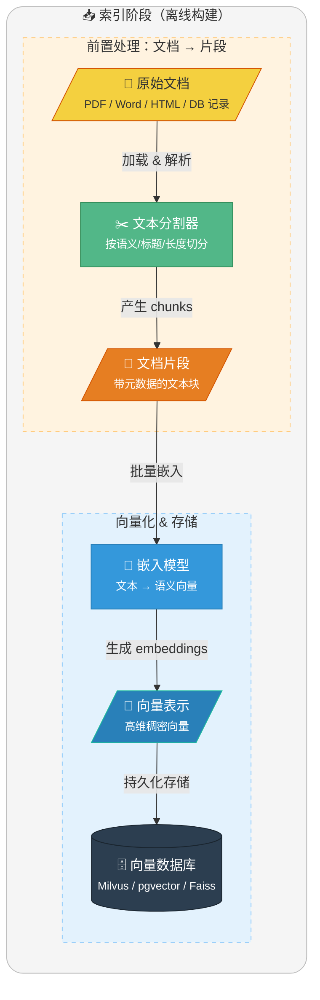
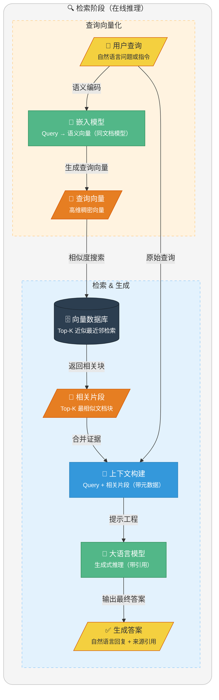
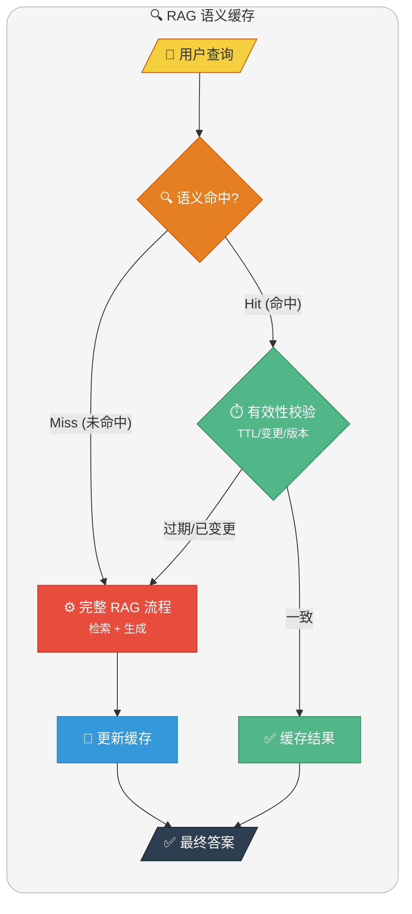

# RAG 常见面试题整理

大家好，我是 Guide。花费一周时间，我终于完成了 RAG 常见面试题的第一版，3.4w+字，光校对都进行了三次。而且，这还只是第一版，后续还会继续完善优化！

毫不夸张地说，这应该是目前全网全面，质量最高的一篇 RAG 面试题总结。

RAG（检索增强生成）是当下 LLM 应用开发的核心技术栈，也是面试中的高频考点。

今天 Guide 带大家系统梳理 RAG 相关的面试题，从基础概念到工程落地，帮你建立完整的知识体系。

这篇内容覆盖了 **RAG 原理、向量数据库、Embedding 模型、文档切分、混合检索、性能优化** 等核心模块，每道题都配有深度解析。无论你是准备面试，还是想系统学习 RAG 技术，这篇文章都能帮到你。

## RAG 基础概念与原理
### ⭐️什么是 RAG？
**RAG (Retrieval-Augmented Generation，检索增强生成)** 是一种将强大的**信息检索 (Information Retrieval, IR)** 技术与**生成式大语言模型 (LLM)** 相结合的框架。

RAG 的核心思想是：在让 LLM 回答问题或生成文本之前，先从一个大规模的知识库（如数据库、文档集合）中检索出相关的上下文信息，然后将这些信息与原始问题一并提供给 LLM，从而“增强”其生成能力，使其能够产出更准确、更具时效性、更符合特定领域知识的回答。


### ⭐️为什么需要 RAG?


尽管 LLM 本身拥有海量的知识，但它依然面临三个核心挑战，而 RAG 正是解决这些挑战的有效方案：

**1. 解决知识时效性问题（对抗"知识截止"）**

预训练的 LLM 的知识被固化在其 **训练数据的截止时间点（Knowledge Cutoff）**。例如，GPT-4 的知识库可能截止于 2023 年 12 月。对于此后发生的新事件、新知识，LLM 无法直接给出准确答案。RAG 通过 **动态检索外部知识源**，为 LLM 提供"实时"的知识补充，从而克服了知识过时的问题。

**2. 打通私有数据访问（赋能企业级应用）**

出于数据安全和商业机密的考虑，企业内部的 **私有数据**（如产品文档、内部知识库、客户数据等）无法被公开的 LLM 直接访问。RAG 技术能够安全地连接这些私有数据源，在用户提问时，仅将与问题相关的片段信息提取出来提供给 LLM，使其能够在 **不泄露全部数据** 的前提下，基于企业自身的知识进行回答，实现真正可用的企业级智能应用。

**3. 提升回答的准确性与可追溯性（对抗"模型幻觉"）**

LLM 有时会产生 **"幻觉（Hallucination）"**，即编造不符合事实的信息。RAG 通过提供明确的、有据可查的参考文本，强制 LLM 的回答 **基于检索到的事实**，大大降低了幻觉的发生率。同时，由于可以展示引用的原文，使得答案的 **来源可追溯、可验证**，增强了系统的可靠性和用户的信任度。

### RAG 的常见用途有哪些？
RAG（检索增强生成）最适合用在 **“答案依赖外部资料、且资料会变化/很长”** 的场景：先从知识库检索相关内容，再让大模型基于检索结果生成回答，从而减少胡编、提升可追溯性。

下面列举几个最常见的场景：

- **客服机器人**：基于产品知识库做问答、排障、流程引导；例：“如何退换货/开发票？”“某型号设备报错码怎么处理？”
- **研发/运维 Copilot**：检索代码库、接口文档、告警手册，辅助定位问题与生成修复建议。
- **医疗助手**：检索指南/药品说明/院内规范后生成辅助建议（不做最终诊断）；例：“某药禁忌是什么？”“依据指南解释检查指标含义”。
- **法律咨询**：基于法规条文/案例/合同模板检索，生成条款解释与风险提示；例：“违约金如何计算？”“不可抗力条款怎么写更稳妥？”
- **教育辅导**：从教材/讲义/题库检索知识点，生成讲解与例题步骤；例：“这道题对应哪个公式？怎么推导？”
- **企业内部助手**：连接制度、SOP、会议纪要、技术文档做检索/总结/对比；例：“某流程最新版本是什么？”“对比两份方案差异并给结论”。
- **其他**：投研/合规/审计（报告/披露/内控）；销售/方案支持（产品手册/标书模板、生成方案并标注出处）。

### ⭐️既然这些场景这么好，为什么有些企业还是宁愿用传统搜索而不是 RAG？
因为 RAG 存在推理成本和响应延迟的问题。在某些纯粹为了“找文件”而非“总结答案”的简单场景，传统搜索依然具备极致的效率优势。

下面简单对比一下二者：

| 维度 | 传统搜索（搜索框） | RAG（检索+生成） |
| --- | --- | --- |
| 用户目标 | 找到文档/页面/附件 | 直接得到可读答案/总结/对比结论 |
| 延迟与成本 | 极低、易扩展 | 更高（检索+LLM 推理） |
| 可控性/可审计 | 强：给原文链接 | 弱一些：可能误解/总结偏差，需要引用与评测 |
| 风险 | 低（主要是召回排序） | 更高（幻觉、引用错误、越权泄露） |
| 数据治理 | 相对成熟（ACL、字段过滤） | 更复杂（检索过滤+上下文脱敏+日志） |
| 适用场景 | 编号/标题/关键词检索、找模板、找制度原文 | 客服解答、技术排障、制度解读、跨文档总结对比 |
| 最佳实践 | ES/BM25 + 权限过滤 | 混合检索 + 重排 + 引用溯源 + 权限过滤 + 评测闭环 |

### RAG 工作原理
RAG 过程分为两个不同阶段：**索引**和**检索**。

在索引阶段，文档会进行预处理，以便在检索阶段实现高效搜索。该阶段通常包括以下步骤：

1. **输入文档**：文档是需要被处理的内容来源，可能是文本文件、PDF、网页、数据库记录等。
2. **清理文档**：对文档进行去噪处理，移除无用内容（如 HTML 标签、特殊字符）。
3. **增强文档**：利用附加数据和元数据（如时间戳、分类标签）为文档片段提供更多上下文信息。
4. **文档拆分（Chunking）**：通过文本分割器（Text Splitter）将文档拆分为较小的文本片段（Segments），严格适配嵌入模型和生成模型的上下文窗口限制（Context Window）。
5. **向量化表示 (Embedding Generation)**：通过嵌入模型（如 OpenAI text-embedding-3 或 Hugging Face 上的开源模型）将文本片段映射为**语义向量表示（Document Embedding，也就是高维稠密向量）**。
6. **存储到向量数据库**：将生成的嵌入向量、原始内容及其对应的元数据存入向量存储库（如 Milvus, Faiss 或 pgvector）。

索引过程通常是离线完成的，例如通过定时任务（如每周末更新文档）进行重新索引。对于动态需求，例如用户上传文档的场景，索引可以在线完成，并集成到主应用程序中。

**索引阶段的简化流程图如下**：



检索通常在线进行的，当用户提交一个问题时，系统会使用已索引的文档来回答问题。该阶段通常包括以下步骤：

1. **接收请求:**  接收用户的自然语言查询（Query），例如一个问题或任务描述。在某些进阶场景中，系统会先对原始查询进行改写或扩充，以提高后续检索的覆盖率。
2. **查询向量化:** 使用嵌入模型（Embedding Model）将用户查询转换为语义向量表示（Query Embedding，也就是高维稠密向量），以捕捉查询的语义信息。
3. **信息检索 (R):** 在嵌入存储（Embedding Store）中，通过语义相似性搜索找到与查询向量最相关的文档片段（Relevant Segments）。
4. **生成增强 (A):** 将检索到的相关片段和原始查询作为上下文输入给 LLM，并使用合适的提示词引导 LLM 基于检索到的信息回答问题。
5. **输出生成 (G):** 向用户输出自然语言回复，并附带相关的参考资料链接。
6. **结果反馈（可选）:** 如果用户对生成的结果不满意，可以允许用户提供反馈，通过调整提示词或检索方式优化生成效果。在某些实现中，支持多轮交互，进一步完善回答。

**检索阶段的简化流程图如下**：



### RAG 与传统搜索引擎的区别是什么？


RAG 与传统搜索引擎虽然都涉及信息获取，但它们在**检索机制、信息处理和交付形式**上有本质区别：

1. **检索机制：**
    - **传统搜索**主要依赖**倒排索引与词汇匹配**（如 BM25、TF-IDF），对关键词的字面形式依赖强。虽然现代搜索引擎也引入了语义理解（如 BERT），但核心仍是基于词汇统计的相关性计算。
    - **RAG** 通常采用**向量语义搜索**，能够识别同义词和深层语境，解决语义鸿沟问题。
2. **处理逻辑：**
    - **传统搜索**本质是**相关性排序器**，将候选文档按相关性得分排序后直接呈现给用户。每个结果相对独立，不进行跨文档的信息融合。
    - **RAG** 的本质是 **信息综合器**，它会将检索到的多个知识碎片（Chunks）喂给 LLM，由模型进行逻辑归纳和跨文档的信息整合。
3. **结果交付：**
    - **传统搜索**提供候选文档列表（线索），需要用户二次阅读过滤；
    - **RAG** 提供的是答案，能直接回答复杂指令，并通过引文标注（Citations）兼顾了信息的来源可追溯性。
4. **时效性与数据范围：** 传统搜索更依赖大规模爬虫和全网索引；RAG 则常用于**私有知识库或垂直领域**，能低成本地让 LLM 获得实时或特定领域的知识补充，无需频繁微调模型。

### ⭐️RAG 的核心优势和局限性分别是什么？
RAG 的核心优势和局限性可以从**知识管理、工程落地和性能指标**三个维度来分析：

**核心优势：**

1. **知识时效性与低维护成本：** 相比微调，RAG 无需重新训练模型。只需更新向量数据库或知识库，模型就能立即获取最新信息，非常适合处理新闻、法规、产品文档等频繁变动的数据。这种即插即用的特性使得知识更新的成本从数千美元降低到几乎为零。
2. **显著降低幻觉并提供引文追溯：** RAG 将模型从"基于参数化记忆生成"转变为"基于检索证据生成"。每个回答都有明确的信息来源，提供了关键的**可解释性和可验证性**。这对金融合规、医疗诊断、法律咨询等对准确性要求极高的场景至关重要。
3. **数据安全与细粒度权限控制：** 可以在检索层实现精准的**多租户隔离和访问控制（ACL）**，确保用户只能检索其权限范围内的数据。相比将敏感数据通过微调"烧入"模型参数（存在数据泄露风险），RAG 的架构天然支持数据隔离和合规要求。
4. **领域适应性强：** 无需针对特定领域重新训练模型，只需构建领域知识库即可快速适配垂直场景，如企业内部知识管理、专业技术支持等。

**局限性与工程挑战：**

1. **严重的检索依赖性：** 遵循GIGO（Garbage In, Garbage Out）原则。如果输入的信息质量不好，即便下游模型再强，也很难输出正确的结果。这个在 RAG 系统里体现得尤为明显。比如说，如果检索阶段的 embedding 表达不准确，或者分块策略不合理，导致召回的内容跟问题无关，那无论上下游用什么大模型，最终生成的答案也不会靠谱。
2. **上下文窗口与推理噪声：** 虽然模型支持的 Context Window 不断扩大（如 Claude 200K、GPT-4 128K），但注入过多的无关片段（Noisy Chunks）仍会干扰模型的逻辑推理。
3. **首字延迟（TTFT）增加：** 完整链路包括"查询改写 -> 向量化 -> 相似度检索 -> 重排序（Rerank）-> 上下文构建 -> LLM生成"，每个环节都增加延迟。
4. **工程复杂度：** 需要维护向量数据库、处理文档更新的增量索引、优化检索策略等，相比纯 LLM 应用复杂度大幅提升。
5. **长文本 Token 成本：** 虽然省去了训练费，但单次请求携带大量上下文会导致推理成本（Input Tokens）显著高于普通对话。

### ⭐️RAG 和微调（Fine-tuning）的区别？如何选择？
**RAG（Retrieval-Augmented Generation，检索增强生成）**：**不改变模型参数**，在推理时动态从外部知识库检索相关内容，将检索结果作为上下文注入prompt，让模型基于这些参考资料生成回答。

- **优点**：知识可随时更新（更新库即可）、能接入私有数据、可做引用溯源（返回来源片段/文档）、降低幻觉率。
- **局限**：效果强依赖检索质量（召回、排序、切分、embedding）；上下文窗口有限；对复杂推理/强约束输出不一定稳定；Token 成本高。
- **适用场景**：企业知识库问答（FAQ、技术文档、产品手册）、实时信息查询（新闻、股价、政策法规）、需要引用来源的场景（学术研究、法律咨询、医疗建议）、多租户SaaS应用（每个客户有独立知识库）。

**微调（Fine-tuning）**：通过训练数据**更新模型权重**，让模型更擅长某类任务、遵循某种风格或输出格式（例如特定字段结构、语气、步骤），也可提升特定领域的表达与指令遵循能力。

- **优点**：推理时不依赖外部检索也能保持稳定风格；对固定任务（分类、结构化抽取、特定写作风格、工具调用习惯）更一致； 不依赖外部系统，适合边缘部署。
- **局限**：对“新知识”并不敏感（知识变更需要重新训练/再训）；训练与数据治理成本更高；可能出现遗忘/偏置；难以提供可验证引用。
- **适用场景**：特定格式输出（JSON生成、SQL查询、代码补全）、风格化写作（品牌文案、特定语气）、任务型对话（客服机器人的固定流程）、

实践中常见组合：**先 RAG 解决知识问题，再用轻量微调优化表达/格式**。

**实际案例：**

- **客服系统：** 微调让模型掌握服务流程和语气，RAG提供产品信息和政策细节
- **代码助手：** 微调提升代码生成质量，RAG检索API文档和最佳实践
- **医疗助手：** 微调确保医学术语准确性，RAG提供最新研究和药物信息

## 向量数据库与检索技术
### 有哪些向量数据库？
对于向量数据库的选型，适合项目的才是最好的，没有银弹！

**第一类：传统数据库扩展**

- **代表：** **PostgreSQL + pgvector** 插件（最成熟的选择，生产环境验证充分）、**MongoDB Atlas Vector Search**（NoSQL领域的向量扩展）
- **核心优势：**
    - **统一技术栈：** 无需引入新的数据库系统，降低运维复杂度
    - **事务一致性：** 向量数据和业务数据可以在同一事务中管理，保证ACID特性
    - **学习成本低：** 团队已有的SQL知识可以复用
    - **混合查询便利：** 可以轻松结合SQL过滤条件进行向量搜索
- **适用场景：** **项目初期或中小型项目**中的首选。特别是在业务数据（如文档元数据）和向量数据需要**强一致性**、能在**同一个事务**里管理时，它的优势巨大。它极大地降低了技术栈的复杂度和运维成本，对于已经在使用PG的团队来说，学习曲线几乎为零。

**第二类：搜索引擎演进**

1. **代表：** Elasticsearch、OpenSearch（AWS维护的ES分支，向量功能持续增强）。
2. **核心优势：**
    - **混合搜索（Hybrid Search）能力强大：** 可无缝结合BM25关键词搜索和向量语义搜索
    - **全文检索能力：** 处理长文本、支持高亮、分词等传统搜索特性
    - **成熟的分布式架构：** 横向扩展能力强
    - **丰富的聚合分析：** 支持facet、aggregation等分析功能
3. **适用场景：** 需要同时支持关键词和语义搜索；电商搜索、文档检索等复合查询场景；已有ES技术栈的团队；需要复杂过滤和聚合的场景，

**第三类：原生专业向量数据库**

- **代表：** **Milvus**（功能最全面、社区最庞大）、**Weaviate**（内置AI模块，支持GraphQL查询，易用性好）、**Qdrant**（Rust编写，内存效率高，支持丰富的过滤器）。
- **核心优势：**
    - **专为向量优化：** 支持多种索引算法（HNSW、IVF、LSH等）
    - **规模化能力：** 可处理十亿级向量
    - **性能极致：** 专门的内存管理和索引优化
    - **功能丰富：** 支持多种距离度量、动态更新、增量索引等
- **适用场景：** 当我们的向量数据规模达到**亿级甚至更高**，或者对**QPS和延迟**有非常苛刻的要求时，这些专业的向量数据库通常会提供比pgvector更好的性能和更丰富的功能（如更高级的索引算法、数据分区、多租户等）。当然，选择这条路也意味着我们需要投入更多的**运维和学习成本**。

**第四类：云托管的向量数据库服务**

- **代表：** **Pinecone**（市场的开创者和领导者）、**Zilliz Cloud**（Milvus的商业版）、**Weaviate Cloud**等。
- **核心优势：**
    - **零运维：** 全托管服务，自动扩缩容
    - **高可用保证：** SLA通常99.9%+
    - **快速上线：** 几分钟即可开始使用
    - **弹性计费：** 按实际使用量付费
- **适用场景：** 对于**追求快速上线、希望降低运维负担、并且预算充足**的团队，这是一个非常有吸引力的选择。它让我们能把所有精力都聚焦在AI应用本身的业务逻辑上，而不用去操心底层数据库的琐事。

### ⭐️你为什么选择 PostgreSQL + pgvector？
本项目需要同时存储结构化数据（简历、面试记录）和向量数据（文档 Embedding）。

**方案对比**：

| 方案 | 优点 | 缺点 |
| --- | --- | --- |
| PostgreSQL + pgvector | 一套数据库搞定，运维简单 | 向量检索性能不如专业向量库 |
| PostgreSQL + Milvus | 向量检索性能更好 | 多一个组件，运维复杂度增加 |
| PostgreSQL + Pinecone | 云托管，无需运维 | 成本高，数据在第三方 |

**选择 pgvector 的理由**：

- 架构简单：不引入额外组件，降低部署和运维复杂度
- 性能够用：HNSW 索引支持毫秒级检索，百万级以下文档场景完全够用
- 事务一致性：向量数据和业务数据在同一数据库，天然支持事务
- SQL 查询：可以结合 WHERE 条件过滤，比如"只在某个分类的知识库中检索"

```sql
-- pgvector 相似度搜索示例
SELECT content, 1 - (embedding <=> $1) as similarity
FROM vector_store
WHERE metadata->>'category' = 'Java'
ORDER BY embedding <=> $1
LIMIT 5;
```

### 为什么不选择 MySQL 搭配向量数据库呢？
PostgreSQL 最大的优势，也是它在 AI 时代甩开对手的“王牌”，就是其强大的可扩展性。开发者可以在不修改内核的情况下，像“即插即用”一样为数据库安装各种功能强大的插件，这让 PostgreSQL 变成了一个无所不能的“数据瑞士军刀”。

- **AI 向量检索？** 有官方推荐的 **pgvector** 扩展，性能强大，生态成熟，足以媲美专业的向量数据库。
- **全文搜索？** 内置支持（能满足基础需求），或使用 **pg_bm25** 等扩展。
- **时序数据？** 有顶级的 **TimescaleDB** 扩展。
- **地理信息？** 有行业标准的 **PostGIS** 扩展。

这种“一站式”解决能力，正是其魅力所在。它意味着许多项目不再需要依赖 Elasticsearch、Milvus 等大量外部中间件，仅凭一个增强版的 PostgreSQL 即可满足多样化需求，从而极大地简化了技术栈，降低了开发和运维的复杂度与成本。

关于 MySQL 和 PostgreSQL 的详细对比，可以参考我写的这篇文章：[MySQL vs PostgreSQL，如何选择？](https://mp.weixin.qq.com/s/APWD-PzTcTqGUuibAw7GGw)。

### 什么是向量索引算法？
向量索引算法是用于高效查找与给定查询向量最相似向量的核心技术。它解决了在海量高维空间中寻找 **“最近邻 (Nearest Neighbor)”** 的性能难题。

向量索引本质上是在做**空间划分**和**数据组织**，让我们能够：

1. **跳过大部分不相关的向量**
2. **只在可能的候选集中精确搜索**

用生活化的比喻：

- **没有索引** = 在整个城市挨家挨户找一个人
- **有索引** = 先确定在哪个区→哪条街→哪栋楼→快速定位

向量索引是向量数据库和RAG系统的核心技术，选对索引算法可以让系统性能提升100倍以上。

### 使用的什么向量索引算法？
在我们的项目中，我们使用的是 **PostgreSQL 的 pgvector 扩展**，并为其配置了 **HNSW 索引**。

**为什么选择HNSW？** 因为在我们的**百万级**数据规模下，HNSW 在**检索速度、召回率和内存占用**之间取得了最佳的平衡。

我们可以把HNSW理解成一个**多层高速公路网络**：

```plain
Layer 2 (稀疏层):  A ◄───────────────── 50km ─────────────────► B
                    │                                           │
Layer 1 (中间层):  A ◄────── 20km ──────► C ◄────── 20km ──────► B
                    │                    │                      │
Layer 0 (基础层):  A ◄── 5km ──► D ◄── 5km ──► C ◄── 5km ──► E ◄── 5km ──► B
```

**核心机制：**

1. **层次化构建：** 节点的最高层级由公式 `level = floor(-ln(random()) * mL)` 决定，其中 `mL` 是层级乘数。这使得越高的层级节点数**指数级递减**，形成"金字塔"结构
2. **贪心搜索**：检索从顶层开始，每层都贪心地移动至距离查询点最近的邻居节点。
3. **由粗到精**：上层用于快速定位语义区域，下层用于执行精确查找。

这种‘从粗到细’的查找方式，使得它能够极快地定位到最近邻的向量，而不需要像暴力搜索那样比较每一个点。

**HNSW的本质是一种近似最近邻（ANN）算法**，这意味着它为了追求极致的速度，**牺牲了 100% 的准确性**。但在实践中，通过调整参数，我们可以让它的召回率达到 99% 以上，这对于RAG应用来说是完全足够了。

**关于调优，** 主要需要关注这几个核心参数：

- **m**：控制图中每个节点的最大连接数。`m` 值越大，图越密集，召回率越高，但会增加索引构建时间和内存消耗。
- **ef_construction**：索引构建时的搜索范围。该值越大，索引质量越高，但构建过程越慢。
- **ef_search**：查询时的搜索范围。这是最重要的运行时参数，直接影响**查询速度和召回率的平衡**。

**当然，我们也考虑了未来的扩展性：**

HNSW是一个非常耗内存的索引。如果未来我们的数据规模增长到**千万甚至亿级**，或者对写入吞吐量有更高要求，HNSW的内存占用和构建成本可能会成为瓶颈。

在那种情况下，我们会考虑切换到 **IVF_FLAT** 索引。IVF是一种基于**倒排索引**思想的算法，它通过将向量空间聚类成多个桶来缩小搜索范围。它的内存占用远低于HNSW，更适合海量数据。或者，我们会考虑引入像**Milvus**这样的**专用向量数据库**，它们在分布式、大规模场景下提供了更专业的解决方案。

除了 HNSW、IVF-Flat，还有IVF-PQ，三者对比如下：

| 算法 | 原理 | 优势 | 劣势 | 适用规模 |
| --- | --- | --- | --- | --- |
| **Flat (暴力搜索)** | 遍历所有向量 | 100%准确 | O(n)复杂度 | <10万 |
| **HNSW** | 分层导航图 | 极快查询，高召回率 | 内存占用大，构建慢 | 10万-1000万 |
| **IVF-Flat** | 聚类+倒排索引 | 内存效率高，构建快 | 需要训练，召回率略低 | 1000万-1亿 |
| **IVF-PQ** | 聚类+乘积量化 | 极度压缩，支持海量数据 | 召回率损失较大 | >1亿 |

### ⭐️HNSW 索引和 IVFFlat 索引的区别是什么？
这两者的核心区别在于：一个是利用 **"图"** 的连通性寻找邻居，一个是利用 **"聚类"** 缩小搜索范围。

**两种索引的查询路径对比**：


**HNSW (Hierarchical Navigable Small World)**

- **原理**：构建多层图结构。查询像在"高速公路"上行驶，先大跨度跳跃，再局部精细搜索
- **优点**：检索速度极快，召回率非常稳定且高
- **缺点**：**"内存吞噬者"**，除了原始向量，还要存储大量节点间的连接关系；索引构建非常慢

**IVFFlat (Inverted File Flat)**

- **原理**：利用 K-Means 将向量空间切分成多个 **"桶"**。查询时先找最近的几个桶，只在桶内进行暴力搜索
- **优点**：**"内存友好"**，结构简单，索引构建速度比 HNSW 快得多
- **缺点**：检索速度略慢于 HNSW（在高精度要求下）；如果数据分布改变，需要重新训练聚类中心

| **特性** | **HNSW (图索引)** | **IVFFlat (倒排聚类)** |
| --- | --- | --- |
| **底层原理** | 层次化小世界图结构 | 聚类 + 倒排桶结构 |
| **查询速度** | **极快** | 中等 |
| **内存消耗** | **极高** (需额外存储大量指针) | 较低 (仅存储质心与 ID) |
| **构建速度** | 慢 (需逐个节点插入并建立连接) | 快 (依赖 K-Means 训练) |
| **数据动态性** | 增量添加非常方便 | 建议全量训练，否则精度随数据偏移下降 |
| **适用规模** | 10 万 - 1000 万级别 | 1000 万 - 1 亿级别 |

**如何选择？**

- **选 HNSW**：数据在百万级，追求毫秒级极速响应，且服务器内存充足
- **选 IVFFlat**：数据达到千万甚至亿级，或内存资源受限，且能够接受稍长的查询延迟

### ⭐️Embedding 模型在 RAG 场景的作用是？
Embedding 模型是 RAG 流程里**检索环节的核心驱动力**：它把“文本”映射成“向量”，让系统能用向量相似度去做语义检索，把最可能相关的知识片段找出来，再交给 LLM 生成。

**1. 文本的向量化表征：**

- 模型通过深度神经网络，将非结构化的文本块转化为 **“ 固定维度的稠密向量 ”**。
- 这一过程将复杂的文字信息压缩成 **“ 高维语义特征 ”**，使得原本无法计算的自然语言变成了可以进行数学运算的数值。

**2. 语义相似度的度量：**

- 在检索阶段，系统利用 **“ 向量距离算法（如 Cosine Similarity 或 Inner Product） ”** 计算用户查询与知识库片段之间的相关性。
- 它有效解决了 **“ 词汇鸿沟 ”** 问题。即使用户的问题与文档的措辞不完全一致，只要语义相近，Embedding 模型就能确保该片段被准确召回。

**3. 降低 LLM 的推理负担：**

- Embedding 模型的作用是进行 **“ 精准降噪 ”**。通过从海量文档中筛选出最相关的 **“ Top-K 个 Chunk ”**，它为后续的大模型生成提供了 **“ 紧凑且高质量的上下文 ”**。
- 这不仅避免了无关信息对模型的干扰，还显著降低了 **“ Token 消耗 ”** 和 **“ 幻觉风险 ”**。

**4. 召回质量的决定因素：**

- Embedding 模型直接决定了 **"召回率上限"**。如果相关内容在向量检索阶段就没被找到，后续的重排序和 LLM 生成再强也无法弥补。
- 实践中常用 **Recall@K** 和 **MRR（Mean Reciprocal Rank）** 来评估 embedding 的召回效果，这是整个 RAG pipeline 的第一道质量关卡。

**5. 混合检索的语义支撑：**

- 在生产环境中，纯向量检索往往不够，需要与 BM25 等传统检索结合形成 **"混合检索"**。
- Embedding 负责捕捉 **"语义相关性"**（同义词、上下位概念），而 BM25 负责 **"精确匹配"**（专有名词、型号、代码），两者互补才能达到最佳召回。

总结来说，Embedding 模型决定了 RAG 系统 ‘ 找得准不准 ’，它是将原始知识转化为模型可理解资产的关键转化器。

### 常见 Embedding 模型有哪些？
**1. 闭源/云端模型（追求上限与易用性）：**

- **OpenAI **`text-embedding-3-large`：行业标杆级文本嵌入模型。支持最高 **3072 维**向量输出，核心特性为 **Matryoshka（俄罗斯套娃）动态维度缩放技术**，可根据存储与检索效率需求，无损压缩至更低维度，兼顾精度与成本。
- **阿里云 **`text-embedding-v4`：国内中文语义场景首选方案。在 **C-MTEB 中文权威榜单**中表现名列前茅，云端 API 调用成本低、响应速度快，适配企业级知识库、中文检索等对语义理解要求严苛的场景。

**2. 开源/私有化模型（追求可控与合规）：**

- **BAAI **`bge-m3`**：** 功能全面的开源模型。独创 **“三位一体检索” 能力**，在单一模型内同时支持稠密向量检索、稀疏关键词匹配、多向量组合检索，适配复杂检索需求；输出维度 1024 维，多语言语义对齐效果突出，支持私有化部署。
- **M3E 系列**：轻量化开源模型经典选择。在 **语义相关性计算**任务中表现稳定，输出维度 768 维，兼顾检索速度与内存占用，部署门槛低，适合中小型项目或边缘设备私有化落地。

**3. 针对特定场景的专项模型：**

- **Jina Embeddings v3：** 开源界超长文本处理标杆。原生支持 **8k tokens 上下文长度**，无需对长文档进行复杂切片，有效避免切片导致的全局语义丢失问题；内置 **5 种 Task LoRA 任务适配器**，可一键切换检索、分类、聚类、文本匹配等任务模式，适配多样化业务需求。

简单对比：

| **模型名称** | **维度 (Dimensions)** | **上下文长度** | **核心技术卖点** |
| --- | --- | --- | --- |
| **OpenAI text-embedding-3-large** | 3072 (可压缩) | 8k | 行业标杆，Matryoshka 动态维度缩放技术 |
| **阿里云 text-embedding-v4** | 2560 | **32k** | 国产领先，超长上下文，多语言 ELO 评分靠前 |
| **BAAI bge-m3** | 1024 | 8k | 三位一体检索：稠密 + 稀疏 + 多向量组合检索 |
| **Jina-Embed-v3** | 1024 (可扩展) | 8k | 5 种 LoRA 任务适配器，原生超长文本处理 |
| **Gemini-v1.5-Embed** | 3072 | 8k | 谷歌生态，跨模态检索兼容性极佳（文本 + 图像 + 音频） |

总结来说，如果是快速验证阶段，建议优先选择 **OpenAI text-embedding-3-large** 或 **通义千问 text-embedding-v4**，开箱即用，无需关注部署细节，快速验证业务效果。如果是内网环境或对多路召回有深度需求，建议 **BAAI bge-m3**。

### 维度越高效果一定越好吗？
不一定！

- **模型能力才是上限**：向量维度只是输出空间大小；如果模型训练数据/目标函数/对齐策略不行，维度再高也只是“更长的向量”，不会自动变聪明。
- **维度灾难风险**：维度升高后，距离度量（余弦/内积/L2）的区分度可能变差，近邻更难“拉开差距”，需要更多数据与更强的训练才能稳定受益。
- **检索与存储成本显著上升**：维度越高，向量库的内存、索引构建时间、查询延迟、带宽都会增加（尤其在大规模数据、HNSW/IVF 等 ANN 索引下更明显）。
- **近似检索更难调**：ANN 在高维下更依赖参数（efSearch、nprobe、M 等），为了保持召回往往要提高搜索深度，进一步增加延迟。

### 既然有了 8k/32k 长度的 Embedding，是不是就不需要文档切片了？
8k 通常指 **8192 tokens**（2 的 13 次方），并不等于 8192 个汉字；换算到中文 **约 6000–7000 汉字**（会随分词方式、标点、数字英文混排而波动）。对应着，32k 对应的汉字数量约为 **24000–28000 字**。

即使这样，仍然是需要文档切片的！

- **语义稀释问题**：将几万字压缩成一个向量会导致语义过于“平均化”，丢失细节信息。
- **定位粒度不足**：RAG 的目标是找到“支撑回答的证据”。如果返回一整章内容，LLM 在阅读长上下文时仍可能产生注意力偏移。
- **计算延迟**：长文本的 Embedding 计算成本与推理延迟呈线性增长。

一句话总结：**长上下文能力让我们能嵌入“更长的逻辑段落”，但为了“检索精度”，依然需要合理的切片策略。**

### ⭐️RAG 知识库文档如何更新？
维护 RAG（检索增强生成）系统的核心在于确保知识库的 **“ 动态性 ”** 与 **“ 准确性 ”**。一个成功的更新机制不仅要能引入新信息，还要能清理旧冗余，并保证检索链路的稳定性。

**1. 语义一致性**：

- 必须使用与初始索引构建时完全一致的 Embedding 模型。如果更换了模型或调整了维度，旧向量与新向量将处于不同的特征空间。这会导致检索时即便语义高度相似，数学距离也会非常遥远，从而引发检索彻底失效。
- 若必须升级模型，则需执行全量重索引。

**2. 精准去重与版本控制**：

- 为了避免知识库膨胀和答案冲突，必须建立数据审计机制。存入向量库前，对原始文档块计算 MD5 或 SimHash 指纹。若指纹一致，则跳过更新，减少无效计算。为每个 Chunk 绑定元数据 `version_id`。采用覆盖写策略。
- 当文档 ID 相同但内容指纹变化时，自动删除旧向量并插入新向量，确保模型始终参考最新的事实标准。

**3. 增量 vs 全量更新选择**：

根据数据变动的频率和规模选择不同的同步路径：

| **策略** | **适用场景** | **优点** | **缺点** |
| --- | --- | --- | --- |
| **增量更新** | 每日零星文档上传、实时新闻流。 | **响应快**，资源消耗极低。 | 长期积累可能导致索引碎片化，影响性能。 |
| **全量更新** | 业务逻辑重大调整、模型架构升级。 | **索引结构最优**，数据一致性最高。 | **耗时长**，在大规模数据集下成本极高。 |

生产环境通常采用 **实时增量 + 定期全量（如每周/每月一次重建） **，以兼顾时效性与检索效率。

### 如何处理向量数据库的扩展性问题？
当向量数据规模从百万级增长到亿级时，必须从 **索引优化**、**存储压缩**、**架构扩展** 和 **冷热分层** 四个层面系统性地解决扩展性挑战：

**1. 索引算法升级**

- **从 HNSW 迁移到 IVF 系列**：HNSW 虽然性能极佳，但内存占用极大（需存储复杂的图拓扑结构），通常适用于千万级以下数据。当规模达到亿级时，建议切换至 **IVF-Flat** 或 **IVF-PQ**。通过聚类建立倒排索引，可以大幅降低内存开销。
- **调整索引参数**：增大 `nlist`（聚类中心数）以适应更大数据量下的空间划分；在检索时适当调整 `nprobe`（搜索桶数），在召回精度与查询速度之间取得最佳平衡。

**2. 向量压缩技术**

- **乘积量化（Product Quantization, PQ）**：将高维向量切分为多个子向量，每个子向量用聚类中心的 ID 表示，可将存储空间压缩 **4-8 倍**。
- **标量量化（Scalar Quantization, SQ）**：将 `float32` 数据降采样为 `int8`，存储空间直接减少 **4 倍**，且精度损失在大多数业务场景下完全可控。
- **降维**：通过 **PCA (主成分分析)** 或直接在训练端选用低维 Embedding 模型（如用 512 维模型替代 1536 维模型），从源头上减少存储与计算开销。

**3. 架构层面扩展**

- **垂直扩展（Scale Up）**：通过升级硬件配置，如增加内存、采用高性能 **NVMe SSD**、引入 **GPU** 加速向量相似度计算。
- **水平扩展（Scale Out）**：
    - **数据分片 (Sharding)**：按业务维度（如租户 ID、文档类型、时间戳）将数据分布到多个节点。
    - **读写分离**：离线构建索引，在线服务仅负责只读查询，通过主从复制提升系统总吞吐。
    - **迁移至原生向量数据库**：当基于关系型数据库的 **pgvector** 遇到性能瓶颈时，考虑迁移至 **Milvus**、**Qdrant** 或 **Weaviate** 等原生支持分布式部署和自动负载均衡的专业数据库。

**4. 冷热数据分层**

将高频访问的热数据保留在内存索引中，低频访问的冷数据落盘或使用更激进的压缩策略，通过 **分层存储** 降低整体成本。

关于冷热分离这个常用的性能优化思想的详细介绍，可以看我这篇文章：[数据冷热分离详解](https://javaguide.cn/high-performance/data-cold-hot-separation.html)。

## 文档处理与切分策略
### 文档拆分（Chunking）怎么做？
我的项目的做法是这样的：

- **先解析再清洗再拆分**：先把 PDF/Word/Markdown 解析成纯文本，清洗噪声后再切分，避免把噪声当上下文。
- **结构优先、长度兜底**：能按标题/段落切就按结构切；遇到超长段落再做“长度切 + 重叠”。
- **重叠控制**：重叠是为了跨段语义连贯，但过大可能造成冗余和噪声。
- **元数据透传**：把 title/section/source/page 等打到 chunk 上，后续检索过滤和引用更稳。
- **平衡颗粒度**：chunk 太大召回差，太小语义不足；需要在召回和生成质量之间找平衡。

### 多模态内容如何在RAG中处理？
在我目前的项目中，我们主要处理的是**文本密集型文档**，比如PDF和Word，通过Tika提取纯文本进行索引。但要构建一个真正强大的RAG系统，处理图像和表格等多模态内容是必然的演进方向。

对于图片和表格的处理，核心是结构化还原和语义对齐：

- **解析阶段：** 图像通过 **CLIP** 提取视觉特征，并辅以 **MLLM**（Multimodal Large Language Model，多模态大语言模型，如GPT-4V） 生成文本描述；表格则强制转化为 **Markdown** 以保持逻辑结构。
- **存储阶段：** 采用 **多向量索引** 策略，将同一素材的描述、向量、摘要建立映射关系。
- **生成阶段：** 采用 **混合检索** 召回素材，并将文本与 **原始图像数据** 一并提交给大模型，利用其原生多模态能力进行跨文档归纳。

### 用户上传空文件，AI 分析如何处理？
在用户选择文件阶段，前端先做简单校验，文件大小小于某个值（如10KB的PDF简历内容一般就有问题）直接拦截。

后端的文件解析服务`DocumentParseService` 检测到空文件，返回空字符串（不抛异常）

具体的业务层服务（Resume/KnowledgeBase）检测到空内容，抛出友好的业务异常。

```java
String content = parseService.parseContent(file);
if (content == null || content.trim().isEmpty()) {
    throw new BusinessException(ErrorCode.INTERNAL_ERROR, "无法从文件中提取文本内容，请确保文件格式正确");
}
```

这样的话，空内容在被拦截，不会进入 AI 分析流程

这种分层校验不仅节省了昂贵的 AI 调用成本，也确保了系统能给用户提供精准的反馈，而不是返回一个莫名其妙的 AI 错误。

### 语义丢失指什么，为什么会发生？
**语义丢失**指的是：原文里的关键信息、约束条件或实体关系，在进入 RAG 的“解析→切分→索引→检索→拼上下文”之后被削弱或断裂，导致模型即使很强也拿不到完整证据，只能基于碎片去推断。它经常发生在链路上，模型侧的长上下文注意力/概括也可能进一步放大这种问题。

为什么会发生，我一般按四类看：

1. **结构解析丢失**：PDF 多栏、表格、标题层级被扁平化成纯文本，阅读顺序错或字段关系断掉；
2. **切分策略不当**：chunk 把一句话的条件和结论切开，比如“收到通知后 7 日内付款”被拆散；
3. **检索与排序不足**：只做向量召回容易漏掉编号、日期、金额等精确字段，TopK 不够或缺少重排导致关键块没进上下文；
4. **上下文拼接与补齐问题**：只拿到子块，没有父块/段落级背景，模型看到的是“局部真相”。

### 如何处理 PDF 多栏、Excel 字段关联等“结构丢失”问题？
处理结构丢失的核心原则是**"保持原始结构语义，延迟扁平化"**——先做结构感知的解析，再带着结构信息去切分和索引。

具体策略分三层：

1. **第一层是文档解析**。不同格式采用专门方案：PDF用版面分析（pdfplumber处理原生PDF，LayoutParser/PaddleOCR处理扫描件）识别多栏、表格、图表区域，保持正确阅读顺序；Excel通过pandas保留表结构，处理合并单元格和公式依赖，序列化时保持行列关系；Word提取标题树和样式信息，维护文档的逻辑层级。
2. **第二层是结构化表示**。把解析结果统一成带元数据的结构化格式——每个内容块都标注来源（文档ID、页码、坐标）、类型（标题/段落/表格/列表）、层级关系和字段映射。表格类数据可以转成记录型JSON，保留字段间的关联。
3. **第三层是工程保障**。大文件做分块并行解析提升效率；解析结果缓存避免重复计算；设置降级策略——当结构解析失败时退回纯文本提取但标记"结构缺失"，让下游知道这部分数据质量受限；最后加入结构完整性校验，比如表格行列数是否一致、标题编号是否连续。

这样处理后，检索和生成环节就能基于结构化信息做更精准的匹配和理解，而不是在碎片化的文本上"猜测"原始含义。

## 检索优化与质量提升
### 为什么需要混合检索？
单一向量检索在某些场景下存在局限性：

- **关键词强依赖场景**：法律条款、技术文档中的专有名词（如"不可抗力""API接口"），向量可能因为上下文不同导致召回不稳定。
- **精确匹配需求**：用户明确指定关键词时（如"包含'违约金'的条款"），需要确保这些词必须出现。
- **语义漂移风险**：纯向量检索可能召回语义相近但业务逻辑不符的内容，造成合规风险。

### ⭐️你是怎么做混合检索的？
混合检索的整体架构如下图所示：


**1. 多路召回架构（Multi-way Recall）**

- **稠密检索（Dense Retrieval）**：利用 Embedding 模型捕捉深层语义，解决 **"同义词"** 和 **"跨语言"** 的召回问题，防止因用户措辞与文档不完全一致导致的漏检。
- **稀疏检索（Sparse Retrieval）**：采用 **BM25 算法** 进行词项匹配，其核心价值在于锁定文档中的 **"硬关键词"**（如法律术语、内部编号、人名），弥补向量检索在处理长尾词时的语义偏移。

**2. 结果融合策略（RRF 算法）**

由于不同检索通道的分值无法直接比较（向量检索返回余弦相似度 0-1，BM25 返回无界分数），我们采用 **RRF（Reciprocal Rank Fusion）算法** 进行融合。

**RRF 公式**：

$ RRF(d) = \sum_{r \in R} \frac{1}{k + rank_r(d)} $

- `d`：候选文档
- `R`：所有检索通道的结果集
- `rank_r(d)`：文档 d 在检索通道 r 中的排名（从 1 开始）
- `k`：平滑常数，通常取 60（防止排名靠前的文档权重过大）

**RRF 的优势**：

- **无需归一化**：只依赖排名，不依赖分数，天然解决了不同检索通道分数不可比的问题。
- **鲁棒性强**：对异常分值不敏感，单路召回的噪声不会过度影响最终排序。
- **调参简单**：只有一个超参数 `k`，实践中 `k=60` 通常效果良好。

**3. 动态调权机制**

- 根据 **用户查询特征** 实时调整权重。
- 如果 Query 包含 **强制匹配符号（如双引号）** 或命中 **专有名词词典**，系统会自动提升 BM25 的权重。
- 对于长句描述或疑问句，则倾向于提升 **向量检索** 的权重，利用模型的推理能力寻找答案。

**4. 上下文增强（父子块策略）**

- 检索时用小块（Small Chunk）提升精准度，因为小块在向量空间中的特征更集中，检索更精准。
- 一旦命中子块，系统自动追溯并提取其背后的“父块”（完整的上下文/段落）喂给 LLM。这确保了 AI 在生成答案时拥有完整的逻辑背景，避免了因断章取义导致的回答偏差。

这种策略的好处是：既保留了 AI 的理解力，又尊重了文档的字面事实，显著降低了在合规、技术文档等严谨场景下的错漏风险。

**5. 融合与重排序（Cross-Encoder））**

在 RRF 融合之后，通常还会接入一个 **Cross-Encoder 重排序模型**：

- **精细打分**：RRF 解决了“入围”问题，而 Cross-Encoder 则通过将 Query 和每一个候选文档块进行成对的深度交叉计算，给出精确的关联概率。
- **效果**：这使得最终输出的 **Top-K 结果** 具有极高的准确率，直接决定了 LLM 回答的质量上限。

### ⭐️如何提升召回质量？
提升召回质量需要从 **Query 理解、检索策略、索引优化、后处理** 四个层面系统性地优化：

**1. Query 理解与改写（Query Understanding & Rewriting）**

- **Query 扩展**：利用同义词词典或 LLM 对用户 Query 进行扩写，生成多个语义等价的变体，扩大召回范围。例如用户问"怎么退货"，扩展为"退货流程"、"申请退款"、"退换货政策"。
- **Query 分解**：对于复杂的多意图 Query，拆分为多个子查询分别检索后合并结果。例如"比较 Redis 和 Memcached 的优缺点"拆分为两个独立查询。
- **HyDE（Hypothetical Document Embeddings）**：让 LLM 先生成一个"假设性答案"，再用这个答案去检索。因为答案与文档的语义分布更接近，往往能召回更相关的内容。

**2. 检索策略优化（Retrieval Strategy）**

- **混合检索（Hybrid Search）**：结合 **稠密向量检索**（语义相似）和 **稀疏检索 BM25**（关键词匹配），用 **RRF** 或加权融合。稠密检索解决"同义不同词"，稀疏检索锁定"硬关键词"（专有名词、编号）。
- **多路召回（Multi-way Recall）**：除了向量和关键词，还可增加基于知识图谱、元数据过滤（时间、分类、权限）等召回通道，最后统一融合排序。
- **父子块策略（Parent-Child Chunking）**：索引时用小块（如 256 tokens）提升检索精度，命中后回填父块（如 1024 tokens）保证上下文完整性。

**3. 索引与 Embedding 优化**

- **Embedding 模型选型**：根据业务场景选择合适的 Embedding 模型。中文场景优先考虑 `bge-m3`、`text-embedding-v4`；多语言场景可选 `text-embedding-3-large`。
- **Fine-tune Embedding**：用业务领域的 Query-Document 对微调 Embedding 模型，提升领域内语义表达能力。
- **分块策略优化**：结构化文档按标题/段落切分，保持语义完整；避免"一刀切"的固定长度切分导致语义断裂。

**4. 后处理与重排序（Post-processing & Reranking）**

- **Cross-Encoder Rerank**：用 **交叉编码器**（如 `bge-reranker`、`cohere-rerank`）对初筛的 Top-K 结果进行精排。Cross-Encoder 能捕捉 Query 和 Document 之间更细粒度的交互特征，显著提升排序质量。
- **LLM Rerank**：用 LLM 对候选文档进行相关性打分或排序，适合对精度要求极高的场景。
- **去重与多样性控制**：对高度相似的召回结果进行去重，避免信息冗余；同时保证结果的多样性，覆盖不同角度的信息。

**5. 评估与迭代**

建立 **Recall@K、MRR、nDCG** 等指标的评测集，定期回归测试，形成"优化→评估→迭代"的闭环。Bad Case 分析是提升召回质量最有效的手段。

### ⭐️如何降低幻觉并保证可追溯？
降低幻觉的核心思路是 **"用证据约束生成"**，同时通过 **"引用机制"** 保证可追溯性：

**1. 用检索证据约束生成（Grounding）**

在系统提示词中明确要求 **仅基于检索到的内容回答**，禁止编造。可加入硬性规则：**未给出证据不得输出结论**、禁止超出证据范围推断。

**System Prompt 示例**：

```latex
你是一个专业的知识库问答助手。请严格遵守以下规则：
1. 只能基于【参考资料】中的内容回答问题，禁止使用你的预训练知识
2. 如果参考资料中没有相关信息，请明确回复"根据现有资料无法回答该问题"
3. 每个关键结论必须标注引用来源，格式为 [来源X]
4. 禁止推测、假设或编造任何信息

【参考资料】
{context}

【用户问题】
{question}
```

**2. 输出可追溯引用（Citation）**

答案中给出 **引用片段** 并附上文档标题、段落位置、URL/文档 ID、更新时间等元信息，做到"每个关键结论都有来源"。

**引用格式示例**：

```markdown
根据公司差旅报销政策，国内出差住宿标准如下：
- 一般员工：不超过 **500元/晚** [来源1]
- 部门经理：不超过 **800元/晚** [来源1]

---
**引用来源：**
[来源1] 《差旅费用报销管理办法 v2.3》第4章第2节，更新时间：2024-06-01
```

**3. 无证据时明确拒答/澄清**

当检索不到相关依据或证据不足时，返回 **"无法从知识库中找到依据"**，并给出需要补充的关键信息（时间范围、产品/模块、术语等），而不是猜测。

**4. Rerank + 置信度阈值（门控）**

用 **Cross-Encoder/LLM Rerank** 提升 Top-K 证据质量，并设置 **相关性分数阈值**（如 0.7）；低于阈值时直接拒答或转人工，避免把噪声证据喂给模型导致幻觉。

**5. 知识库治理**

版本管理、去重、过期文档下线、按权限过滤（ACL）。否则"引用可追溯但内容本身错误/过期"仍会误导用户。

### RAG 的评估指标有哪些？
**检索指标（Retrieval）**：衡量“能不能把对的证据找回来”

- **Recall@K**：TopK 里是否包含“正确证据/相关文档”（覆盖率指标，RAG 最常用）
- **Hit Rate@K（命中率）**：TopK 是否命中至少一个相关证据（0/1 命中）
- **MRR（Mean Reciprocal Rank）**：第一个相关结果出现得越靠前越好
- **nDCG@K**：支持多等级相关性标注，更关注排序质量（越靠前权重越高）
- （可补充）**Precision@K**：TopK 里相关的比例，用于控制噪声证据

**生成指标（Generation / Answer Quality）**：衡量“回答是否正确、是否基于证据”

- **准确性/正确性（Correctness）**：答案与标准答案是否一致（可人工或 LLM-as-judge）
- **可引用性/可追溯性（Attribution / Citation quality）**：关键结论是否有对应引用；引用是否真的支持结论
- **完整性（Completeness）**：是否覆盖问题的关键点、有没有漏答
- **一致性与无幻觉（Faithfulness / Groundedness）**：回答内容是否都能在证据中找到依据
- **可读性/表达质量**：结构清晰、术语准确、格式符合要求
- **用户满意度（CSAT/点赞率/采纳率）**：最终业务视角的质量指标

**系统指标（System / Engineering）**：衡量“能不能稳定、便宜、快地跑”

- **延迟（P50/P95/P99）**：检索、重排、生成各阶段与端到端
- **成本**：每次请求 token 成本、向量检索/重排成本、整体 cost per answer
- **吞吐（QPS）与并发稳定性**：峰值下的成功率、超时率
- **缓存命中率**：query cache / embedding cache / 检索结果 cache 命中
- （可补充）**可用性与错误率**：5xx、重试次数、降级触发率

### 面对 RAG 的推理延迟，你会采取哪些优化措施？
优化 RAG 的推理延迟需要从**感知优化、检索链路优化**和**模型推理优化**三个层面并行：

**1. 感知层优化（降低用户焦虑）：**

- **流式响应 (Streaming)：** 采用 SSE (Server-Sent Events) 协议，让 LLM 边生成边展示，将首字延迟控制在 500ms 以内。
- **任务异步化：** 对于复杂的长文本分析任务，我会利用 **Redis Stream 或 RabbitMQ** 进行解耦，后端处理完后通过 WebSocket 异步推送结果，保证系统在高并发下的吞吐稳定。

**2. 检索层优化（缩短搜索时间）：**

- **语义缓存 (Semantic Cache)：** 利用 Redis 缓存高频请求及其向量。通过阈值判断语义相似度，命中缓存则直接返回结果，响应时间可从秒级降至毫秒级。
- **索引与硬件加速：** 在向量数据库（如 Milvus/Pinecone）中使用 HNSW 索引，并尽可能利用 GPU 加速 Embedding 的计算。
- **并行化处理：** 将多路召回（向量+全文）和元数据过滤并行化。

**3. 模型层优化（减少生成耗时）：**

- **精简上下文：** 在 Rerank 环节过滤掉低分片段，减少注入给 LLM 的 Token 数量（Context Window 越长，推理越慢）。
- **算子优化：** 采用 vLLM 或 TensorRT-LLM 框架进行推理，利用连续批处理（Continuous Batching）和 PagedAttention 技术提升并发处理能力。

### ⭐️如果使用了语义缓存，如何处理数据过期导致回答不准确的问题？
处理语义缓存的数据一致性问题，比传统缓存更具挑战。以下是分层校验的策略：

**语义缓存校验流程图**：



**1. 基础 TTL + 语义阈值动态调整（被动失效）**

- 设置合理的 **TTL（Time To Live）** 是最基础的兜底策略
- 同时，根据业务的实时性要求动态调整相似度阈值。例如：对于高时效性问题，调高相似度要求，迫使系统更多地穿透到实时检索层

**2. 基于元数据的版本校验（Metadata Versioning）**

- 在存入缓存时，将该回答所依赖的所有 **Document IDs 及其当前版本号（或 Timestamp）** 作为元数据存入 Redis
- 命中缓存后，系统会并行发起一个轻量级的元数据查询，检查底层文档的版本是否已更新。如果任一文档版本落后，则判定缓存失效，重新执行 RAG 流程

### 如果文档更新非常频繁（如分/秒级），元数据校验会不会成为性能瓶颈？
在分/秒级更新的极端场景下，频繁的元数据校验确实会由于 **I/O 往返和锁竞争** 成为系统瓶颈。我会从以下三个层面进行架构优化：

**1. 引入二级校验机制 (L1 Local Filter)：**

- 在业务服务端内存中维护一个轻量级的 **BitSet 或 Cuckoo Filter**。当底层文档发生变更时，通过消息队列同步更新所有节点的内存过滤器。
- **逻辑：** 命中语义缓存后，先在内存中进行‘秒级校验’。如果过滤器显示该关联文档未变更，则直接返回，完全避免了跨网络查询元数据数据库的开销。

**2. 采用‘概率性失效’与‘静默期’策略：**

- **静默期 (Cool-down Period)：** 对于极高频更新的文档，设置一个微小的缓存静默期（如 3-5 秒）。在静默期内，即使数据有微小变动也复用旧缓存，从而将校验频率从‘每请求一次’降低到‘每时间窗口一次’。
- **热点探测：** 自动识别更新频率过高的文档。如果更新频率超过阈值，系统会自动对关联的缓存标记为‘不可缓存’，直接退化为实时检索，避免无效的缓存维护开销。

**3. 批量化与异步刷新 (Batch & Async Refresh)：**

- 并不在用户请求链路上同步‘删除’缓存，而是标记其为‘Stale（陈旧）’。
- 后台开启异步任务，利用 **Redis Pipeline** 批量校验版本号，并统一清理过期条目。这种方式能将原本 O(N) 的网络开销显著降低。

**4. 性能指标对比：** 通过这种分层校验，我们可以将 90% 的无效校验阻断在内存层，将元数据校验的耗时从 **毫秒级降至微秒级**，从而抵消掉高频更新带来的性能损耗。

### 如何权衡缓存命中率和回答准确率？
这是一个 **Trade-off**。不同场景的要求是不一样的，金融/医疗/法律一般对准确率要求非常高，企业内部知识库和电商/通用客服要相对低一些。

### ⭐️怎么支撑高并发（比如 1W QPS）的 RAG 检索？
支撑高并发 RAG 检索需要从 **架构设计、性能优化、容错降级** 三个层面综合考虑：

**高并发 RAG 检索架构示意图**：


**1. 架构层面**

- **分片策略（Sharding）**：向量索引按业务维度（文档类型、租户、时间范围）分片，实现检索并行化。单分片控制在合理规模（如 **500 万向量以内**），避免单点瓶颈。
- **读写分离**：离线构建索引，在线服务只读，通过定时或增量方式同步更新。写入不影响读取性能。
- **多副本部署**：每个分片部署多个只读副本，通过负载均衡分散读压力。

**2. 性能优化**

- **多级缓存**：
    - **L1 本地缓存**：缓存 Embedding 计算结果和热点 Query，减少重复计算
    - **L2 Redis 集群**：缓存高频 Query 的检索结果（Top 20-30%），根据知识库更新频率设置合理 TTL
- **前置过滤**：利用元数据（文档类型、时间戳、权限等）建立倒排索引，**先粗筛再向量检索**，缩小搜索空间
- **索引优化**：调整 HNSW 参数（`ef_search`）平衡精度和性能；数据量大时采用 **IVF-PQ** 量化技术降低内存占用
- **异步化**：Embedding 计算、Rerank 等耗时操作异步处理，关键路径优先保证响应速度

**3. 容错降级**

- **限流熔断**：设置 QPS 阈值和熔断策略（如 Sentinel/Hystrix），防止系统过载导致雪崩
- **多级降级方案**：
    - **一级降级**：向量检索超时 → 降级到 BM25 关键词检索
    - **二级降级**：BM25 也失败 → 返回预设的默认答案或提示"系统繁忙，请稍后重试"
- **监控告警**：实时监控检索延迟（**P99**）、缓存命中率、向量库 CPU/内存使用率，设置阈值告警及时发现瓶颈

**4. 关键指标参考**

| 指标 | 目标值 |
| --- | --- |
| 检索延迟 P99 | < 100ms |
| 缓存命中率 | > 70% |
| 系统可用性 | > 99.9% |
| 单分片向量数 | < 500万 |

实际落地时需要根据业务特点做压测验证，逐步调优各环节参数。

## 参考
**RAG 基础与原理**

- [Retrieval-Augmented Generation for Knowledge-Intensive NLP Tasks](https://arxiv.org/abs/2005.11401) - RAG 原始论文（Meta/Facebook AI）
- [LangChain RAG 官方文档](https://python.langchain.com/docs/tutorials/rag/) - RAG 实践入门指南
- [LlamaIndex 官方文档](https://docs.llamaindex.ai/) - 另一个主流 RAG 框架

**向量数据库与索引算法**

- [pgvector 官方文档](https://github.com/pgvector/pgvector) - PostgreSQL 向量扩展
- [Milvus 官方文档](https://milvus.io/docs) - 分布式向量数据库
- [HNSW 原始论文](https://arxiv.org/abs/1603.09320) - Hierarchical Navigable Small World 算法
- [Faiss Wiki](https://github.com/facebookresearch/faiss/wiki) - Facebook 向量检索库，包含 IVF/PQ 等算法详解

**Embedding 模型**

- [OpenAI Embeddings 文档](https://platform.openai.com/docs/guides/embeddings) - text-embedding-3 系列
- [BGE 模型系列](https://github.com/FlagOpen/FlagEmbedding) - 智源开源 Embedding 模型（bge-m3 等）
- [MTEB Leaderboard](https://huggingface.co/spaces/mteb/leaderboard) - Embedding 模型评测榜单

**检索优化与评估**

- [Reciprocal Rank Fusion (RRF)](https://plg.uwaterloo.ca/~gvcormac/cormacksigir09-rrf.pdf) - RRF 融合算法原始论文
- [RAGAS 评估框架](https://docs.ragas.io/) - RAG 系统评估指标与工具
- [Cohere Rerank](https://docs.cohere.com/docs/rerank) - 重排序模型文档
