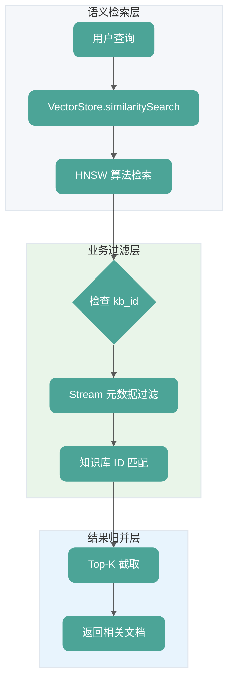

大家好，我是 Guide。Spring AI 是 Spring 官方打造的 AI 应用开发框架，旨在将 AI 能力无缝集成到 Spring 生态系统中。它提供统一的、与具体模型无关的 API，让 Java开发者可以轻松实现**大模型调用、RAG（检索增强生成）、结构化输出以及流式响应**等核心功能。

本篇内容覆盖了 **Spring AI 基础、ChatClient 模型调用、Prompt 工程与模板、向量存储与 Embedding、流式响应与 SSE、异步处理、异常处理、配置与调优** 等核心模块，每道题都配有深度解析并结合项目实战代码。无论你是准备面试，还是想系统学习 Spring AI 技术，这篇文章都能帮到你。

需要注意，本篇内容主要是针对《SpringAI 智能面试平台+RAG知识库》用到的技术总结相关的面试题，后续会持续补充完善！

## Spring AI 基础
### 什么是 Spring AI?
**Spring AI** 是 Spring 官方打造的 AI 应用开发框架，旨在将 AI 能力无缝集成到 Spring 生态系统中。它侧重于提供构建 AI 应用所需的**底层原子能力抽象**，让 Java 开发者可以像使用其他 Spring 组件一样，轻松地与大语言模型进行交互。

| 能力 | 说明 | 本项目应用场景 |
| --- | --- | --- |
| **模型通信 (ChatClient)** | 统一接口与不同 LLM（OpenAI、Ollama、通义千问等）对话 | 简历评分、面试评估、知识库问答 |
| **提示词 (Prompt)** | 结构化管理发送给模型的提示词 | 使用 `.st` 模板文件管理提示词 |
| **RAG (检索增强生成)** | 通过 `VectorStore` 实现 RAG 模式 | 知识库向量化存储与语义检索 |
| **工具调用 (Function Calling)** | 模型调用 Java 应用中定义的方法 | - |
| **记忆 (ChatMemory)** | 管理多轮对话的上下文历史 | RAG 聊天会话管理 |


> **注意**：Spring AI 本身未提供多智能体（Multi-agent）开发能力。若需在 Spring AI 项目中开发多智能体应用，可以考虑集成 **LangGraph4j**（Java 版 LangGraph）。
>

### ⭐️为什么选择 Spring AI?
如果你的项目基于 Spring Boot 技术栈，并且希望获得官方的长期支持、紧跟 Spring 生态发展步伐，那么可以优先考虑 Spring AI。

**核心优势**：

| 优势 | 说明 |
| --- | --- |
| **无缝集成** | 与现有 Spring Boot 技术栈完美融合，学习成本低，能快速上手 |
| **高度抽象** | 提供统一的、与具体模型无关的 API，轻松在 OpenAI、Ollama、通义千问之间切换 |
| **生态整合** | 整合向量数据库（Chroma, PGVector）、ETL 框架等 AI 应用开发所需的整个工具链 |


目前，Java 依然是企业级开发的主流，市面上有多款 AI 应用开发框架：

| 框架 | 特点 | JDK 基线 | 框架绑定 | 适用场景 |
| --- | --- | --- | --- | --- |
| [Spring AI](https://github.com/spring-projects/spring-ai) | Spring 官方，原生集成 | **JDK 17+**（建议 JDK 21） | **Spring Boot 3.2+**（本项目使用 4.0.1） | Spring 项目首选，未来主流 |
| [LangChain4j](https://github.com/langchain4j/langchain4j) | 功能全面，更新快 | JDK 8+ | 无限制（Boot 2.x/3.x） | 老项目，兼容性需求 |
| [Solon-AI](https://github.com/opensolon/solon-ai) | 轻量化，性能优秀 | JDK 8+ | Solon 生态（也支持 Boot） | Serverless、GraalVM 原生镜像 |
| [Agent-Flex](https://github.com/agents-flex/agents-flex) | 专注于 Agent 编排 | JDK 11/17+ | 无框架依赖 | Agent 编排需求为主 |


**Spring AI 的杀手锏**：它是 Spring 生态的"原生延伸"。将 AI 能力抽象成了标准组件，就像我们熟悉的 `JdbcTemplate` 或 `RestTemplate` 一样。对于老 Spring 玩家来说，接入成本几乎为零。

技术要为业务服务，不要为了炫技而引入复杂性。绝大多数商业场景不需要你突破算法，而是要解决这四个痛点：**大模型调用、RAG（检索增强生成）、结构化输出以及流式响应**。

Spring AI 2.0 在这些领域已经扎得足够深：

+ **RAG 自动化**：对向量数据库（Redis, Milvus, pgvector）的抽象极其优雅，真正实现了"代码解耦"。同时支持 **Query Rewrite（改写）** 与 **前置过滤（Pre-filtering）**，显著提升召回精度。
+ **性能榨取**：全面拥抱 **Java 21 虚拟线程（Virtual Threads）**，在处理高并发、长连接的 SSE AI 请求时，资源消耗极低，吞吐量提升明显。
+ **工程规范**：配合 Spring Boot 4.0 和统一封装的 **StructuredOutputInvoker**，让 AI 模块的重试与结构化解析具备生产级鲁棒性。

### Python在 AI 领域更强大，考虑过吗？
这是一个很好的问题。确实，Python 在 AI/ML 领域有更成熟的生态（PyTorch、LangChain、HuggingFace 等）。但选择 Java + Spring AI 有其合理性：

**1. 应用场景不同**

+ **Python 擅长**：模型训练、算法研究、数据科学、快速原型验证
+ **Java 擅长**：企业级应用开发、高并发服务、复杂业务逻辑

本项目是一个 **AI 应用** 而非 **AI 模型**，核心是调用大模型 API 而非训练模型。在这个场景下，Java 的工程化能力、类型安全、成熟的企业级生态反而是优势。

**2. 团队技术栈**

如果团队主要是 Java 开发者，强行引入 Python 会带来：

+ 技术栈分裂，增加维护成本
+ 需要处理 Java 和 Python 服务间的通信
+ 部署复杂度上升

**3. 性能与稳定性**

Java 在长时间运行的服务中通常表现更稳定，JVM 的垃圾回收、JIT 编译在高并发场景下经过了充分验证。

**4. Spring AI 已经足够**

对于 **调用大模型 API、构建 RAG 应用、Embedding 向量化** 这些需求，Spring AI 的能力已经完全够用。我们不需要 Python 生态中那些用于模型训练的库。

**5. 架构预留了扩展性**

本项目通过 **Redis Stream 解耦了 AI 任务处理**，这是一个关键的架构决策：

```plain
┌─────────────────┐     Redis Stream      ┌─────────────────┐
│  Java 主服务    │ ──── 发送任务 ────→   │   消费者服务    │
│  (Spring Boot)  │                       │  (Java/Python)  │
└─────────────────┘     ←── 结果回写 ──── └─────────────────┘
```

+ **当前阶段**：消费者用 Java 实现，与主服务技术栈统一，开发效率高
+ **未来扩展**：如果需要更复杂的 AI 能力（如本地模型推理、自定义 Embedding、Agent 编排），可以用 **Python 实现新的消费者**，无缝接入现有架构

这种设计的好处：

+ 主服务保持稳定，不受 AI 模块影响
+ AI 模块可以独立迭代、独立扩缩容
+ 技术选型灵活，哪个语言适合就用哪个

**结论**：技术选型应该根据具体场景和团队情况决定，而不是盲目追求"更强大"的技术。同时，好的架构设计应该为未来的变化预留空间。

## ChatClient 与模型调用
### ⭐️ Spring AI 中如何调用大模型？
`ChatClient` 是 Spring AI 提供的流式 API，用于与大语言模型进行对话。本项目在三个核心场景中使用 ChatClient：

1. **简历评分**：`ResumeGradingService` - 分析简历内容并给出评分和建议
2. **面试评估**：`AnswerEvaluationService` - 评估面试回答并生成报告
3. **RAG 问答**：`KnowledgeBaseQueryService` - 基于知识库回答用户问题

**基本调用模式：**

```java
@Service
public class InterviewQuestionService {

    private final ChatClient chatClient;

    // 通过 ChatClient.Builder 构建（推荐方式）
    public InterviewQuestionService(ChatClient.Builder chatClientBuilder) {
        this.chatClient = chatClientBuilder.build();
    }

    public String generateQuestion(String resume) {
        return chatClient.prompt()
            .system("你是一位资深面试官...")  // 系统提示词
            .user(resume)                      // 用户输入
            .call()                            // 同步调用
            .content();                        // 获取文本内容
    }
}
```

**结构化输出（映射为 Java 对象）：**

本项目中，我们需要让 AI 返回结构化的面试问题列表，而不是纯文本。Spring AI 的 `BeanOutputConverter` 可以自动处理：

```java
// 定义响应结构
private record QuestionListDTO(List<QuestionDTO> questions) {}
private record QuestionDTO(String question, String type, String category) {}

// 使用 BeanOutputConverter
private final BeanOutputConverter<QuestionListDTO> outputConverter =
    new BeanOutputConverter<>(QuestionListDTO.class);

public List<QuestionDTO> generateQuestions(String resume) {
    // 将格式指令追加到系统提示词
    String systemPromptWithFormat = systemPrompt + "\n\n" + outputConverter.getFormat();

    QuestionListDTO dto = chatClient.prompt()
        .system(systemPromptWithFormat)
        .user(userPrompt)
        .call()
        .entity(outputConverter);  // 自动解析 JSON 为 Java 对象

    return dto.questions();
}
```

`outputConverter.getFormat()` 会生成类似这样的指令：

```plain
Your response should be in JSON format.
The data structure for the JSON should match this Java class: ...
```

### ⭐️ Spring AI 中如何确保结构化解析的稳定性？
直接调用 `ChatClient` 解析 JSON 有时会因为网络波动或模型输出微小偏差导致失败。我通过封装 `StructuredOutputInvoker` 实现了生产级的稳定性：

1. **自动重试机制**：针对 `BeanOutputConverter` 的解析异常进行业务级重试。
2. **错误反馈闭环**：重试时将上次解析失败的 Error 注入到新提示词中，引导模型自我纠错。
3. **参数动态调优**：对解析失败的请求自动下调 `Temperature`，增强输出的确定性。

### ⭐️ ChatClient.Builder 和 ChatClient 有什么区别？
这是 Spring AI 中一个常见的困惑点：

**ChatClient.Builder**：

+ 由 Spring AI 自动配置并注入
+ 每次调用 `build()` 会创建新的 `ChatClient` 实例
+ 可以在 `build()` 前进行定制化配置

**ChatClient**：

+ 实际执行 API 调用的对象
+ 通常在 Service 构造器中通过 `Builder.build()` 创建并复用

**为什么不直接注入 ChatClient？**

Spring AI 的设计理念是让开发者可以在构建时进行定制。例如添加默认的系统提示词、配置拦截器等：

```java
public MyService(ChatClient.Builder builder) {
    this.chatClient = builder
        .defaultSystem("你是一个专业的助手")  // 全局默认系统提示词
        .build();
}
```

本项目中，我们直接使用默认配置：

```java
// InterviewQuestionService.java:57-61
public InterviewQuestionService(
        ChatClient.Builder chatClientBuilder,
        @Value("classpath:prompts/interview-question-system.st") Resource systemPromptResource,
        @Value("classpath:prompts/interview-question-user.st") Resource userPromptResource) {
    this.chatClient = chatClientBuilder.build();
    // ...
}
```

### call() 和 stream() 的区别是什么？
`call()` - 同步阻塞调用：

+ 等待 AI 完整生成响应后一次性返回
+ 适用于对延迟不敏感的后台任务（如**面试评分、分批评估**）

`stream()` - 流式响应：

+ 返回 `Flux<String>`，AI 生成一个 token 就推送一个
+ 适用于需要实时展示的场景（如聊天界面）

**本项目的流式优化（探测窗口算法）**：  
在 RAG 问答场景下，为了防止 AI 在未检索到信息时输出长篇拒答，我实现了一个 **探测窗口 (Probe Window)**。系统会先缓冲前 120 个字符，若识别为拒答话术则直接截断并返回统一模板；若为有效回答则立刻放流，兼顾了体验与稳定性。

本项目的 RAG 知识库问答同时支持两种模式：

```java
// KnowledgeBaseQueryService.java

// 同步调用（用于后台处理）- 第71-110行
public String answerQuestion(List<Long> knowledgeBaseIds, String question) {
    // 1. 验证知识库是否存在并更新问题计数
    countService.updateQuestionCounts(knowledgeBaseIds);

    // 2. 使用向量搜索检索相关文档（RAG）
    List<Document> relevantDocs = vectorService.similaritySearch(question, knowledgeBaseIds, 5);

    // 3. 构建上下文
    String context = relevantDocs.stream()
        .map(Document::getText)
        .collect(Collectors.joining("\n\n---\n\n"));

    // 4. 构建提示词
    String systemPrompt = buildSystemPrompt();
    String userPrompt = buildUserPrompt(context, question, knowledgeBaseIds);

    // 5. 调用AI生成回答
    String answer = chatClient.prompt()
        .system(systemPrompt)
        .user(userPrompt)
        .call()
        .content();

    return answer;
}

// 流式调用（用于前端实时展示）- 第152-197行
public Flux<String> answerQuestionStream(List<Long> knowledgeBaseIds, String question) {
    // 1-3. 同上（检索相关文档、构建上下文和提示词）
    // ...

    // 4. 流式调用AI生成回答
    Flux<String> responseFlux = chatClient.prompt()
        .system(systemPrompt)
        .user(userPrompt)
        .stream()
        .content();

    return responseFlux
        .doOnComplete(() -> log.info("流式输出完成: kbIds={}", knowledgeBaseIds))
        .onErrorResume(e -> {
            log.error("流式输出失败: kbIds={}, error={}", knowledgeBaseIds, e.getMessage(), e);
            return Flux.just("【错误】知识库查询失败：AI服务暂时不可用");
        });
}
```

## Prompt 工程与模板
### ⭐️ 如何管理和组织 Prompt？
在实际项目中，Prompt 可能会很长且需要频繁调整。直接硬编码在 Java 代码中会导致：

+ 代码可读性差
+ 修改 Prompt 需要重新编译
+ 难以进行版本管理

**本项目的做法：Prompt 模板文件化**

将 Prompt 存储在 `resources/prompts/` 目录下，使用 `.st`（StringTemplate）格式：

```plain
resources/
└── prompts/
    ├── interview-question-system.st   # 面试问题生成-系统提示词
    ├── interview-question-user.st     # 面试问题生成-用户提示词
    ├── interview-evaluation-system.st # 答案评估-系统提示词
    ├── resume-analysis-system.st      # 简历分析-系统提示词
    └── knowledgebase-query-system.st  # 知识库问答-系统提示词
```

**加载与使用：**

```java
@Service
public class InterviewQuestionService {

    private final PromptTemplate systemPromptTemplate;
    private final PromptTemplate userPromptTemplate;

    public InterviewQuestionService(
            ChatClient.Builder chatClientBuilder,
            @Value("classpath:prompts/interview-question-system.st") Resource systemPromptResource,
            @Value("classpath:prompts/interview-question-user.st") Resource userPromptResource) throws IOException {

        // 加载模板文件
        this.systemPromptTemplate = new PromptTemplate(
            systemPromptResource.getContentAsString(StandardCharsets.UTF_8)
        );
        this.userPromptTemplate = new PromptTemplate(
            userPromptResource.getContentAsString(StandardCharsets.UTF_8)
        );
    }

    public List<InterviewQuestionDTO> generateQuestions(String resumeText, int questionCount) {
        // 渲染系统提示词（无变量）
        String systemPrompt = systemPromptTemplate.render();

        // 渲染用户提示词（带变量）
        Map<String, Object> variables = new HashMap<>();
        variables.put("questionCount", questionCount);
        variables.put("resumeText", resumeText);
        String userPrompt = userPromptTemplate.render(variables);

        // 调用 AI
        return chatClient.prompt()
            .system(systemPrompt)
            .user(userPrompt)
            .call()
            .entity(outputConverter);
    }
}
```

**模板文件示例（interview-question-system.st）：**

```markdown
# Role
你是一位拥有 10 年以上经验的资深 Java 后端技术专家及大厂面试官。

# Task
请根据候选人简历生成针对性的面试问题集。

# Question Types
| 类型 | 说明 |
|------|------|
| PROJECT | 项目经历 |
| MYSQL | 数据库 |
| REDIS | 缓存 |
...

# Output Format
请直接输出一个 JSON 对象，不要包含 Markdown 代码块标签。
```

### Prompt 设计有哪些最佳实践？
**1. 角色设定（Role）**

明确 AI 应该扮演的角色，这会显著影响输出质量：

```plain
你是一位拥有 10 年以上经验的资深 Java 后端技术专家及大厂（如阿里、腾讯、字节）面试官。
```

**2. 任务描述（Task）**

清晰说明需要完成什么任务：

```plain
请根据用户提供的【候选人简历内容】，生成一套针对性的面试问题集。
```

**3. 约束条件（Constraints）**

明确限制条件，避免 AI "跑偏"：

```plain
- 问题必须与简历内容高度相关，严禁出现简历未涉及的技术栈
- type 字段仅限 8 种枚举值
- 每道题目必须具有区分度
```

**4. 输出格式（Output Format）**

精确指定输出格式，特别是需要结构化输出时：

```plain
请直接输出一个 JSON 对象，不要包含 Markdown 代码块标签（如 ```json ）。
JSON 结构必须严格包含以下字段：
- questions: 对象数组，每个对象包含：
  - question: 字符串，面试问题内容
  - type: 字符串，问题类型
  - category: 字符串，细分类别
```

**5. 示例驱动（Few-shot）**

提供示例可以让 AI 更好地理解期望的输出：

```plain
示例输出：
{
  "questions": [
    {
      "question": "请介绍你项目中的分布式锁实现方案",
      "type": "PROJECT",
      "category": "分布式"
    }
  ]
}
```

## 向量存储与 Embedding
### ⭐️ Spring AI 如何集成向量数据库？
Spring AI 的 `VectorStore` 抽象层让我们可以轻松实现 RAG（检索增强生成）功能。本项目使用 PostgreSQL + pgvector 作为向量数据库。

这部分的详细介绍可以查看这篇文章：[Spring AI + pgvector 实现 RAG 知识库问答](https://www.yuque.com/snailclimb/itdq8h/grm2dzfgrcb16cb8)。

**依赖配置（build.gradle）：**

```groovy
// Spring AI 2.0 - PostgreSQL Vector Store (pgvector)
implementation "org.springframework.ai:spring-ai-starter-vector-store-pgvector:${springAiVersion}"
```

**应用配置（application.yml）：**

```yaml
spring:
  ai:
    vectorstore:
      pgvector:
        index-type: HNSW                # 索引算法
        distance-type: COSINE_DISTANCE  # 距离度量
        dimensions: 1024                # 向量维度
        initialize-schema: true         # 自动建表
        remove-existing-vector-store-table: false  # 保留现有表和数据
```

**使用方式：**

采用基于 Token 的切分策略（TokenTextSplitter）。相比字符切分，Token 切分更能贴合大模型的上下文窗口限制，并设置重叠区（Overlap）以防止语义在切分处断裂。

针对阿里云 DashScope 等主流 Embedding 接口的并发与批量限制（如单次最多 10 条），实现了分批入库逻辑，避免触发 API 报错并提升入库稳定性。

在向量化阶段将业务标识（如 `kb_id`）注入文档 Metadata，为后续的多租户隔离和快速过滤奠定基础。

```java
@Slf4j
@Service
public class KnowledgeBaseVectorService {

    /**
     * 阿里云 DashScope Embedding API 批量大小限制
     */
    private static final int MAX_BATCH_SIZE = 10;

    private final VectorStore vectorStore;
    private final TextSplitter textSplitter;

    public KnowledgeBaseVectorService(VectorStore vectorStore, VectorRepository vectorRepository) {
        this.vectorStore = vectorStore;
        this.vectorRepository = vectorRepository;
        // 使用 TokenTextSplitter，每个 chunk 约 500 tokens，重叠 50 tokens
        this.textSplitter = new TokenTextSplitter();
    }

    /**
     * 将知识库内容向量化并存储
     */
    @Transactional
    public void vectorizeAndStore(Long knowledgeBaseId, String content) {
        // 1. 删除该知识库的旧向量数据（支持重新向量化）
        deleteByKnowledgeBaseId(knowledgeBaseId);

        // 2. 文本分块：按 token 切分，每块约 500 tokens
        List<Document> chunks = textSplitter.apply(List.of(new Document(content)));

        // 3. 添加元数据：标记每个 chunk 属于哪个知识库
        chunks.forEach(chunk -> chunk.getMetadata().put("kb_id", knowledgeBaseId.toString()));

        // 4. 分批向量化并存储
        // 阿里云 DashScope API 限制 batch size <= 10，需要分批处理
        int totalChunks = chunks.size();
        int batchCount = (totalChunks + MAX_BATCH_SIZE - 1) / MAX_BATCH_SIZE;

        for (int i = 0; i < batchCount; i++) {
            int start = i * MAX_BATCH_SIZE;
            int end = Math.min(start + MAX_BATCH_SIZE, totalChunks);
            List<Document> batch = chunks.subList(start, end);
            vectorStore.add(batch);  // 调用 Embedding API 并存储到 pgvector
        }

        log.info("知识库向量化完成: kbId={}, chunks={}, batches={}",
                knowledgeBaseId, totalChunks, batchCount);
    }
}
```

**代码说明**：

+ **分块策略**：使用 `TokenTextSplitter` 按 token 切分，每块约 500 tokens，重叠 50 tokens 保证上下文连贯性。
+ **元数据标注**：为每个 chunk 添加 `kb_id` 元数据，支持按知识库过滤检索。
+ **批次控制**：阿里云 DashScope Embedding API 限制每次最多 10 个文本，需要分批处理。
+ **事务支持**：使用 `@Transactional` 确保向量删除和添加的原子性。

### 向量相似度搜索如何实现？
在实现多知识库的相似度搜索时，我采用了 **语义检索 + 内存过滤** 的混合方案。其核心逻辑是：首先利用向量数据库进行高维向量的近似最近邻搜索（ANN），然后结合业务维度的元数据进行精确过滤，最后进行结果截取。

**核心实现流程：**

1. **语义检索层**：利用 `VectorStore` 将用户查询实时向量化，并在底层数据库（如 pgvector）中通过 HNSW 算法检索语义最接近的文档片段。
2. **业务过滤层**：针对多知识库场景，在获取向量搜索结果后，通过 Stream 流对文档元数据（Metadata）中的 `kb_id` 进行匹配校验，确保数据隔离性。
3. **结果归并层**：根据配置的 `topK` 值对过滤后的结果进行截取，确保返回最相关且数量受控的上下文。

```java
/**
 * 基于多个知识库进行相似度搜索
 */
public List<Document> similaritySearch(String query, List<Long> knowledgeBaseIds, int topK) {
    // 1. 向量相似度检索：使用 Spring AI 的 VectorStore 进行语义检索
    List<Document> allResults = vectorStore.similaritySearch(query);

    // 2. 元数据过滤：如果指定了知识库ID，只保留匹配的结果
    if (knowledgeBaseIds != null && !knowledgeBaseIds.isEmpty()) {
        allResults = allResults.stream()
            .filter(doc -> {
                Object kbId = doc.getMetadata().get("kb_id");
                if (kbId == null) return false;
                try {
                    Long kbIdLong = kbId instanceof Long
                        ? (Long) kbId
                        : Long.parseLong(kbId.toString());
                    return knowledgeBaseIds.contains(kbIdLong);
                } catch (NumberFormatException e) {
                    return false;
                }
            })
            .collect(Collectors.toList());
    }

    // 3. Top-K 截取：限制返回数量
    return allResults.stream()
        .limit(topK)
        .collect(Collectors.toList());
}
```

**代码说明**：

+ **语义检索**：`VectorStore.similaritySearch()` 自动将 query 向量化并在 pgvector 中进行 HNSW 相似度检索。
+ **元数据过滤**：支持按知识库 ID 过滤，实现多知识库联合检索或单独检索。
+ **类型兼容**：兼容 `Long` 和 `String` 类型的 `kb_id`，确保向后兼容。
+ **Top-K 返回**：限制返回数量，避免返回过多无关结果。

流程图：




### ⭐️ 为什么需要分批处理 Embedding？
这是本项目在知识库向量化过程中的一个核心工程优化。

**问题背景：**

阿里云 DashScope 的 Embedding 接口对单次请求的文本数量有严格限制（最多 10 条）。而一份知识库文档经过 `TokenTextSplitter` 切分后，通常会产生几十甚至上百个文本块。如果一次性发送，会导致请求失败。

**解决方案（**`KnowledgeBaseVectorService.java`**）：**

```java
private static final int MAX_BATCH_SIZE = 10;

public void vectorizeAndStore(Long knowledgeBaseId, String content) {
    // 1. 文本分块
    List<Document> chunks = textSplitter.apply(List.of(new Document(content)));

    // 2. 计算批次数（向上取整）
    int totalChunks = chunks.size();
    int batchCount = (totalChunks + MAX_BATCH_SIZE - 1) / MAX_BATCH_SIZE;

    // 3. 分批调用 vectorStore.add()
    for (int i = 0; i < batchCount; i++) {
        int start = i * MAX_BATCH_SIZE;
        int end = Math.min(start + MAX_BATCH_SIZE, totalChunks);
        List<Document> batch = chunks.subList(start, end);
        vectorStore.add(batch);  // 每批最多 10 个
    }
}
```

**工程价值：**

+ 将复杂的 API 限制封装在 Service 内部，对上层业务透明。
+ 无论文档多大，系统都能自动平稳地完成向量化。
+ 避免因超限导致的请求失败。

### 如何为文档添加元数据？
在 RAG 架构中，元数据不仅是文档的附加信息，更是实现 **多租户隔离、权限控制及精准检索** 的核心手段。我采用的是“写入时注入、检索时过滤”的闭环方案。

**核心实现思路**：

1. **注入阶段（写入时）**：在文档分块（Chunking）后，将业务维度的唯一标识（如 `kb_id`）统一注入到每个 `Document` 对象的 `metadata` Map 中。这一步保证了每一条向量数据都自带业务标签。
2. **过滤阶段（检索时）**：
    - **语义优先**：首先利用向量索引在大规模数据中快速筛选出语义最相关的候选集。
    - **精确过滤**：随后在候选集中通过 Stream 流进行元数据匹配，确保最终返回的结果集完全符合业务范围（如指定的一组知识库 ID）。
3. **兼容性设计**：考虑到生产环境数据的演进，在过滤逻辑中加入了类型容错处理，同时支持 `Long` 和 `String` 类型，确保了系统的健壮性。

**核心代码实现如下：**

1. 写入：元数据标注

```java
// KnowledgeBaseVectorService.java:55-57
// 为每个 chunk 添加 kb_id 元数据（统一使用 String 类型存储）
chunks.forEach(chunk ->
    chunk.getMetadata().put("kb_id", knowledgeBaseId.toString())
);
```

2. 检索时按 kb_id 过滤：

```java
/**
 * 基于多个知识库进行相似度搜索
 */
public List<Document> similaritySearch(String query, List<Long> knowledgeBaseIds, int topK) {
    // 1. 向量相似度检索：使用 Spring AI 的 VectorStore 进行语义检索
    List<Document> allResults = vectorStore.similaritySearch(query);

    // 2. 元数据过滤：如果指定了知识库ID，只保留匹配的结果
    if (knowledgeBaseIds != null && !knowledgeBaseIds.isEmpty()) {
        allResults = allResults.stream()
            .filter(doc -> {
                Object kbId = doc.getMetadata().get("kb_id");
                if (kbId == null) return false;
                try {
                    Long kbIdLong = kbId instanceof Long
                        ? (Long) kbId
                        : Long.parseLong(kbId.toString());
                    return knowledgeBaseIds.contains(kbIdLong);
                } catch (NumberFormatException e) {
                    return false;
                }
            })
            .collect(Collectors.toList());
    }

    // 3. Top-K 截取：限制返回数量
    return allResults.stream()
        .limit(topK)
        .collect(Collectors.toList());
}
```

通过在检索链条中强制执行 `kb_id` 过滤，从逻辑上实现了不同用户或业务模块间的数据隔离，是实现权限控制的基础。

本项目当前采用后置过滤，优点是 **数据库兼容性强**，不依赖特定向量数据库的复杂语法。

不过，后置过滤仅适用于小规模数据或演示场景，后续分享的`FilterExpression`（前置过滤）是生产环境更合适的做法。

### 如果查出来的前 10 条都不符合 kb_id 过滤条件，导致最后返回结果为空怎么办？
在后置过滤（Post-filtering）模式下，我们先做向量检索（Top-K），再用 Java 代码过滤。如果 `kb_id` 匹配的数据刚好排在第 11 名及以后，而你只取了前 10 名，就会导致结果为空或不足。

最直接的办法是将过滤逻辑下沉到向量数据库。在执行向量近似搜索的同时，利用数据库的标量索引（Scalar Index）先剔除不符合 `kb_id` 的记录。

使用 **Spring AI** 提供的 `FilterExpression` 可以优雅地实现这一点：

```java
/**
 * 优化后的搜索实现：采用前置过滤解决“结果空洞”问题
 */
public List<Document> similaritySearch(String query, List<Long> knowledgeBaseIds, int topK) {
    // 1. 使用 Builder 构建流式表达式
    FilterExpressionBuilder b = new FilterExpressionBuilder();
    
    // 2. 动态构建 IN 查询条件
    // 只有当传入了知识库 ID 列表时才进行过滤
    Filter.Expression filterExpression = (knowledgeBaseIds != null && !knowledgeBaseIds.isEmpty())
            ? b.in("kb_id", knowledgeBaseIds.stream().map(Object::toString).toArray()).build()
            : null;

    // 3. 将过滤条件封装进 SearchRequest
    SearchRequest request = SearchRequest.query(query)
            .withTopK(topK)
            .withFilterExpression(filterExpression); // 关键：数据库层面的过滤

    // 4. 执行检索
    // 此时 vectorStore 会在满足 kb_id 条件的数据集中寻找最相似的 topK 条
    return vectorStore.similaritySearch(request);
}
```

**为什么前置过滤能解决“空结果”？**

这是面试官最想听到的逻辑闭环：

+ **后置过滤（Post-Filtering）的问题**： 向量数据库是一个“黑盒”，它先根据向量距离弹出最接近的 10 条数据。如果这 10 条都不属于你的知识库，Java 层面的 `filter` 就会把它们全部剔除，导致最终 **Result = 0**。
+ **前置过滤（Pre-Filtering）的优势**： 它告诉向量数据库：“请**只看**那些 `kb_id` 在列表中的数据，并从中给我找最像的 10 条”。只要指定的知识库里有数据，返回的结果就永远不会因为过滤而变少，除非该知识库本身的总数据量少于 `topK`。

### 如果前置过滤导致索引失效怎么办？
确实存在这种情况。在某些向量数据库中，前置过滤如果通过标量索引筛选掉 99.9% 的数据，可能会导致向量索引（如 HNSW）无法有效工作。

但对于**多租户/多知识库**场景，我们通常会对 `kb_id` 建立**复合索引**。在 pgvector 中，我们可以通过元数据字段建立 Gin 索引或普通的 B-tree 索引。Spring AI 的 `FilterExpression` 屏蔽了底层实现，但在数据库层面，我们会通过执行计划优化，确保先通过标量索引缩小空间，再进行向量计算，从而兼顾准确性和性能。

## 流式响应与 SSE
### ⭐️ 如何实现 AI 回答的流式输出？
在 RAG 系统中，由于大模型生成全文需要较长时间，为了降低用户感知延迟，我采用了基于 **SSE (Server-Sent Events)** 的流式输出方案。这种方案相比 WebSocket 更轻量，且原生支持 HTTP 协议。

流式输出让用户可以实时看到 AI 的回答，而不是等待全部生成完毕，显著提升用户体验。

Spring WebFlux 原生支持 SSE，通过 `MediaType.TEXT_EVENT_STREAM_VALUE` 和 `Flux<ServerSentEvent<T>>` 可以轻松实现流式输出。

**基础用法**：

```java
@GetMapping(value = "/stream", produces = MediaType.TEXT_EVENT_STREAM_VALUE)
public Flux<String> streamData() {
    return Flux.interval(Duration.ofMillis(500))
        .map(seq -> "data: 消息 " + seq + "\n\n");
}
```

+ `MediaType.TEXT_EVENT_STREAM_VALUE`：声明响应类型为 SSE 事件流，值为 `text/event-stream`。
+ `Flux<String>`：响应式流类型，返回多个字符串事件。
+ `Flux.interval()`：每 500 毫秒发射一个递增序列。
+ 手动拼接 SSE 格式：`data:` 前缀 + `\n\n` 分隔符。

**使用 **`ServerSentEvent`** 包装：**

```java
@GetMapping(value = "/stream", produces = MediaType.TEXT_EVENT_STREAM_VALUE)
public Flux<ServerSentEvent<String>> streamData() {
    return Flux.interval(Duration.ofMillis(500))
        .map(seq -> ServerSentEvent.<String>builder()
            .id(String.valueOf(seq))           // 事件 ID
            .event("custom-event")              // 自定义事件类型
            .data("消息 " + seq)                // 事件数据
            .retry(3000L)                       // 重连间隔
            .build());
}
```

+ `ServerSentEvent<T>`：Spring 提供的 SSE 事件包装类，自动处理 SSE 格式。
+ 字段说明：
    - `id()`：设置事件唯一标识，客户端断线重传时可作为断点恢复的依据。
    - `event()`：自定义事件类型，客户端可通过 `addEventListener('custom-event')` 监听。
    - `retry()`：告诉客户端连接断开后等待多久重连（毫秒）。

**Spring AI 的 **`ChatClient`** 提供了流式调用接口**：

```java
Flux<String> responseFlux = chatClient.prompt()
    .system(systemPrompt)
    .user(userPrompt)
    .stream()  // 关键：使用 stream() 方法启用流式输出
    .content();
```

### 流式响应中如何处理错误？
在流式输出场景下，错误处理极具挑战性，因为 HTTP 状态码通常在连接建立时就已经发送（200 OK），一旦流中途断开，无法通过传统的异常处理器返回错误 JSON。我针对这一特性，设计了一套基于 **响应式钩子** 的可靠性方案。

**本项目的策略：**

1. **保存已接收的部分内容**：即使中途出错，也尽量保存已生成的内容。
2. **前端优雅降级**：当流异常中断时，后端会捕获异常并包装成特定的 SSE 错误信号或友好提示推送到前端，确保前端 UI 能够正确停止加载状态并给予用户反馈。
3. **日志记录**：记录详细错误信息便于排查。

```java
.doOnError(e -> {
    // 即使出错也保存已接收的内容
    String content = !fullContent.isEmpty()
        ? fullContent.toString()
        : "【错误】回答生成失败：" + e.getMessage();
    sessionService.completeStreamMessage(messageId, content);
    log.error("RAG 聊天流式错误: sessionId={}", sessionId, e);
});
```

## 异步处理
### ⭐️ 为什么使用 Redis Stream 处理 AI 任务？
AI 调用通常比较耗时（几秒到几十秒），如果同步处理会导致：

+ HTTP 请求超时。
+ 服务器线程被长时间占用。
+ 用户体验差（长时间等待无响应）。

### 如何实现任务重试机制？
在知识库向量化这种耗时且依赖外部 API（Embedding 服务）的场景下，我设计了一套完整的任务生命周期管理机制。该方案通过 **自动补偿、手动干预、前端静默轮询** 三者结合，构建了可靠的任务闭环。

当任务处理失败时，如果未超过最大重试次数（默认 3 次），消费者会将任务重新发送到 Stream：


对于已标记为 FAILED 的任务，提供手动重试 API：

```java
// Controller
@PostMapping("/api/knowledgebase/{id}/revectorize")
public Result<Void> revectorize(@PathVariable Long id) {
    uploadService.revectorize(id);
    return Result.success(null);
}

// Service
@Transactional
public void revectorize(Long kbId) {
    KnowledgeBaseEntity kb = knowledgeBaseRepository.findById(kbId)
        .orElseThrow(() -> new BusinessException(ErrorCode.NOT_FOUND, "知识库不存在"));

    // 重新下载并解析文件
    String content = parseService.downloadAndParseContent(
        kb.getStorageKey(), kb.getOriginalFilename());

    // 重置状态
    kb.setVectorStatus(VectorStatus.PENDING);
    kb.setVectorError(null);
    knowledgeBaseRepository.save(kb);

    // 发送新任务
    vectorizeStreamProducer.sendVectorizeTask(kbId, content);
}
```

前端通过定时轮询获取任务状态更新：

```typescript
// KnowledgeBaseManagePage.tsx
useEffect(() => {
  // 只有存在待处理任务时才启动轮询
  const hasPendingItems = knowledgeBases.some(
    kb => kb.vectorStatus === 'PENDING' || kb.vectorStatus === 'PROCESSING'
  );

  if (hasPendingItems && !loading) {
    const timer = setInterval(() => {
      loadDataSilent();  // 静默刷新，不显示 loading 状态
    }, 5000);  // 每 5 秒轮询一次

    return () => clearInterval(timer);
  }
}, [knowledgeBases, loading, loadDataSilent]);
```

| 优化 | 说明 |
| --- | --- |
| 条件轮询 | 仅当存在 PENDING/PROCESSING 任务时才轮询 |
| 静默刷新 | 不显示 loading 状态，避免页面闪烁 |
| 合理频率 | 5 秒间隔，平衡实时性与服务器压力 |


### 如果任务量非常大，几千个任务同时在轮询，该如何优化？
引入 WebSocket 或 SSE 进行主动推送；或者在前端采用 指数退避轮询（即任务运行时间越长，轮询频率越低），进一步平衡实时性与服务器负载。

## 异常处理
### 如何优雅处理 AI 服务异常？
在 AI 驱动的应用中，大模型 API 的稳定性（如网络波动、限流、配额耗尽）是系统的核心风险点。我通过 **全局异常捕捉、分类精细化处理、以及静态数据降级** 三层防线，确保了系统在高可用方面的韧性。

通过 Spring 的 `@RestControllerAdvice` 实现全局拦截，将复杂的底层网络异常（如 SSL 握手失败、Socket 超时）和 API 业务异常（如 401 密钥失效、429 触发限流）转化为用户可理解的业务错误码。

```java
/**
 * 处理 AI 服务网络异常（SSL握手失败、连接超时等）
 */
@ExceptionHandler(ResourceAccessException.class)
@ResponseStatus(HttpStatus.OK)
public Result<Void> handleResourceAccessException(ResourceAccessException e) {
    Throwable cause = e.getCause();

    // 超时异常
    if (cause instanceof SocketTimeoutException) {
        return Result.error(ErrorCode.AI_SERVICE_TIMEOUT,
            "AI服务响应超时，请稍后重试");
    }

    // SSL握手失败
    if (e.getMessage().contains("handshake")) {
        return Result.error(ErrorCode.AI_SERVICE_UNAVAILABLE,
            "AI服务连接失败（网络不稳定），请检查网络或稍后重试");
    }

    return Result.error(ErrorCode.AI_SERVICE_UNAVAILABLE,
        "AI服务暂时不可用，请稍后重试");
}

/**
 * 处理 AI 服务 API 异常
 */
@ExceptionHandler(RestClientException.class)
@ResponseStatus(HttpStatus.OK)
public Result<Void> handleRestClientException(RestClientException e) {
    String message = e.getMessage();

    // API Key 无效
    if (message.contains("401") || message.contains("Unauthorized")) {
        return Result.error(ErrorCode.AI_API_KEY_INVALID,
            "AI服务密钥无效，请联系管理员");
    }

    // 限流
    if (message.contains("429") || message.contains("Too Many Requests")) {
        return Result.error(ErrorCode.AI_RATE_LIMIT_EXCEEDED,
            "AI服务调用过于频繁，请稍后重试");
    }

    return Result.error(ErrorCode.AI_SERVICE_ERROR,
        "AI服务调用失败，请稍后重试");
}
```

**错误码设计（ErrorCode.java）：**

| 错误码 | 含义 |
| --- | --- |
| 7001 | AI_SERVICE_UNAVAILABLE - AI服务不可用 |
| 7002 | AI_SERVICE_TIMEOUT - AI服务超时 |
| 7003 | AI_SERVICE_ERROR - AI服务错误 |
| 7004 | AI_API_KEY_INVALID - API Key无效 |
| 7005 | AI_RATE_LIMIT_EXCEEDED - 调用频率超限 |


### ⭐️如何实现 AI 调用的降级策略？
当核心 AI 生成链路断开时，系统自动切换至本地静态题库，保证用户基础业务流程不中断。

降级数据不仅仅是简单的提示，而是精心挑选的高频面试题。这种设计将“技术灾难”转化为“可接受的功能降级”，在面试官眼中是极佳的工程素养体现。

**本项目的降级策略（**`InterviewQuestionService.java`**）：**

```java
public List<InterviewQuestionDTO> generateQuestions(String resumeText, int questionCount) {
    try {
        // 正常调用 AI
        return chatClient.prompt()
            .system(systemPromptWithFormat)
            .user(userPrompt)
            .call()
            .entity(outputConverter);
    } catch (Exception e) {
        log.error("生成面试问题失败: {}", e.getMessage(), e);
        // 降级：返回预设的默认问题
        return generateDefaultQuestions(questionCount);
    }
}

/**
 * 生成默认问题（备用）
 */
private List<InterviewQuestionDTO> generateDefaultQuestions(int count) {
    String[][] defaultQuestions = {
        {"请介绍一下你在简历中提到的最重要的项目", "PROJECT", "项目经历"},
        {"MySQL的索引有哪些类型？B+树索引的原理是什么？", "MYSQL", "MySQL"},
        {"Redis支持哪些数据结构？各自的使用场景是什么？", "REDIS", "Redis"},
        // ... 更多默认问题
    };

    List<InterviewQuestionDTO> questions = new ArrayList<>();
    for (int i = 0; i < Math.min(count, defaultQuestions.length); i++) {
        questions.add(InterviewQuestionDTO.create(
            i, defaultQuestions[i][0],
            QuestionType.valueOf(defaultQuestions[i][1]),
            defaultQuestions[i][2]
        ));
    }
    return questions;
}
```

这样即使 AI 服务完全不可用，用户仍然可以进行面试练习。

在生产环境下，我们后续还考虑引入 **Sentinel 或 Resilience4j** 来实现自动**熔断**。当 AI API 的错误率超过 50% 时，系统会自动切断对 AI 的请求，直接进入降级模式，从而避免因大量请求堆积在超时等待上而拖垮整个 Web 服务器。

## Spring AI 配置与调优
### Spring AI 有哪些重要配置项？
**本项目的完整配置（**`application.yml`**）：**

```yaml
spring:
  # Spring AI - 阿里云DashScope (OpenAI兼容模式)
  ai:
    openai:
      # API 端点配置
      base-url: https://dashscope.aliyuncs.com/compatible-mode
      api-key: ${AI_BAILIAN_API_KEY}

      # Chat 模型配置
      chat:
        options:
          model: ${AI_MODEL:qwen-plus}  # 模型名称（可通过环境变量覆盖）
          temperature: 0.2              # 输出随机性（0-1，越高越随机）

      # Embedding 模型配置
      embedding:
        options:
          model: text-embedding-v3      # Embedding 模型

    # 重试配置
    retry:
      max-attempts: 1                   # 不重试，失败立即返回
      on-client-errors: false           # 客户端错误不重试

    # 向量存储配置
    vectorstore:
      pgvector:
        index-type: HNSW                # 索引算法
        distance-type: COSINE_DISTANCE  # 距离度量
        dimensions: 1024                # 向量维度（text-embedding-v3 实际生成的维度）
        initialize-schema: true         # 自动建表
        remove-existing-vector-store-table: false  # 保留现有表和数据
```

**配置说明：**

| 配置项 | 说明 | 建议值 |
| --- | --- | --- |
| temperature | 控制输出随机性 | 0.2（偏确定性；需更多多样性时可上调） |
| max-attempts | 重试次数 | 生产环境建议 2-3 次 |
| index-type | 向量索引类型 | HNSW（性能最佳） |
| dimensions | 向量维度 | 与 Embedding 模型匹配 |


### 为什么禁用自动重试？
配置中设置了 `max-attempts: 1`，即不重试。原因是：

1. **快速失败**：让用户尽快知道出错了，而不是长时间等待。
2. **避免重复计费**：某些 AI API 按调用次数计费。
3. **业务层控制**：由业务代码决定重试策略（如异步任务中的重试）。

在异步任务场景（Redis Stream 消费者），我们在业务层实现了更精细的重试控制。

### 如何选择合适的 temperature？
在 LLM 应用开发中，`Temperature` 是调节输出概率分布平滑度的核心超参数。它本质上是在模型输出层的 **Softmax** 函数中引入的一个缩放因子，直接决定了生成内容的随机性与连贯性。

**不同业务场景的取值策略**：

| **取值区间** | **效果描述** | **推荐业务场景** |
| --- | --- | --- |
| **0.0 - 0.2** | **极度严谨**：输出可预测，逻辑严密 | JSON 提取、SQL 生成、数据清洗、代码纠错 |
| **0.3 - 0.5** | **稳健平衡**：在保持逻辑的基础上减少重复感 | 简历解析、技术文档摘要、代码续写 |
| **0.7 - 0.8** | **灵动自然**：兼顾专业性与表达的丰富度 | 面试题生成、通用助手、客服对话等对多样性要求较高的场景 |
| **0.9 - 1.2** | **天马行空**：鼓励跳跃性思维 | 创意文案、诗歌创作、头脑风暴 |


在简历分析并生成面试题的场景中，**如果主要追求出题多样性**，可以考虑将 temperature 调整到 **0.7**，原因包括：

+ **多样性需求**：面试不应该只有一套标准模板。我们需要 AI 能够针对同一份简历，从不同的切入点（如项目难点、技术细节、软技能）生成多维度的提问，0.7 能提供这种适度的变通。
+ **专业性边界**：如果值过高（如 1.0 以上），模型可能会虚构技术名词或偏离求职者的真实项目背景，导致生成的问题不符合职业面试的严肃性。
+ **逻辑连贯性**：面试题需要符合上下文逻辑，0.7 能够在保证问题的业务逻辑合理（不胡说八道）的前提下，让语言表达更像真人面试官。

本项目当前在 `application.yml` 中的默认配置为 `temperature: 0.2`，偏向**结构化输出和结果稳定性**；如需在某些场景（例如仅生成面试题时）提升多样性，可在环境变量或单独的模型配置中上调该值。

## 高级特性与最佳实践
### 如何实现多租户的 RAG 系统？
本项目通过 **Metadata 过滤** 实现了简单的多租户隔离：

```java
// 存储时标记所属知识库
chunks.forEach(chunk ->
    chunk.getMetadata().put("kb_id", knowledgeBaseId.toString())
);

// 检索时按知识库过滤
List<Document> results = vectorStore.similaritySearch(query).stream()
    .filter(doc -> knowledgeBaseIds.contains(doc.getMetadata().get("kb_id")))
    .collect(Collectors.toList());
```

在向量入库时，为每一个分块（Chunk）强制注入租户标识（如 `tenant_id` 或 `kb_id`）。在检索时，通过数据库索引对该字段进行硬性过滤。

**更完善的方案：**

如果需要更严格的租户隔离，可以考虑：

1. **Schema 隔离**：为每个租户创建独立的数据库 Schema（如 PostgreSQL Schema）。
2. **Table 隔离**：每个租户使用独立的向量表。
3. **Collection 隔离**：在 Milvus 等专业向量库中创建独立 Collection。

### 如何处理长文本场景下的 Token 溢出问题？
在模拟面试的评估环节，由于整场面试的对话记录（Question + Answer）往往超过模型的 Context Window 限制，直接提交会导致 API 报错。我设计并实现了 **分批评估 + 二次总结** 架构：

1. **动态分批**：将面试记录按可配置的批次（如 8 组/批）进行逻辑切分。
2. **阶段评估**：对每批次独立调用大模型，生成局部维度评分。
3. **二次总结 (Summary Refinement)**：将各阶段的评估 JSON 作为输入，由模型生成最终的全局面试报告。
4. **容错降级**：若二次总结失败（如解析报错），系统自动降级为对分批结果进行简单的加权物理合并，确保评估链路的 100% 可靠产出。

### ⭐️ 为什么在处理流式对话时推荐使用 Java 21 虚拟线程？
AI 对话（SSE）是典型的 **IO 密集型且高延迟** 场景。

**痛点**：传统线程池模式下，一个用户连接会占用一个物理线程。在 AI 生成 Token 的漫长等待中（几秒到几十秒），该线程会被阻塞，导致服务器并发能力受限且资源浪费严重。

**解决方案**：全面启用 **Java 21 虚拟线程（Virtual Threads）**。

+ **极致吞吐**：虚拟线程是用户态线程，创建成本极低。当 AI 调用阻塞时，虚拟线程会自动释放载体物理线程，让其去处理其他任务。
+ **并发承载**：在不改变同步编程习惯的前提下，单实例即可支撑万级并发的流式 SSE 会话。
+ **本项目应用**：在 `application.yml` 中开启 `spring.threads.virtual.enabled=true` 即可。

### 如何优化 RAG 的检索质量？
在本项目中，我针对 RAG 检索的准确性与鲁棒性进行了多维度的深度优化：

1. **查询改写 (Query Rewrite)**：  
   用户输入的原始 Query（如 "Java"、"面试"）往往过于简短，缺乏语义检索价值。我引入了 **Query Rewrite** 能力，利用 LLM 结合当前会话上下文将原始 Query 扩展为语义丰富的长句（如 "请总结该候选人的 Java 面试表现及核心考点"），显著提升了向量检索的命中精度。
2. **动态检索参数矩阵 (Top-K/minScore)**：  
   不再使用固定的 `Top-K=5`。系统会根据改写后的 Query 长度自动切换检索策略：
    - **短 Query**：采用大召回策略（`Top-K=20`, `minScore=0.18`），确保不漏掉潜在信息。
    - **长 Query**：采用精简策略（`Top-K=8`, `minScore=0.28`），提升上下文的信息密度。
3. **有效命中判定 (Effective Hit Detection)**：  
   为了防止模型对弱相关片段进行过度解读（幻觉），我增加了**有效命中判定逻辑**。针对短词 Query，若检索出的片段中未物理包含原始关键词，则视为无效命中，直接触发统一的简洁拒答模板，拦截了 90% 以上的无效生成。
4. **检索过滤前置 (Pre-filtering)**：  
   主导将过滤逻辑从“先检索再过滤”升级为“**SearchRequest 级前置过滤**”。通过 `FilterExpression` 在数据库层面完成 `kb_id` 过滤，彻底解决了后置过滤导致的“召回空洞”问题。

**进一步优化方向：**

1. **混合检索 (Hybrid Search)**：结合向量相似度与传统关键词检索（BM25）。
2. **重排序 (Rerank)**：引入 Reranker 模型对初步召回的片段进行精细评分。
3. **查询改写进阶**：引入 Multi-Query 或 HyDE 等技术。
